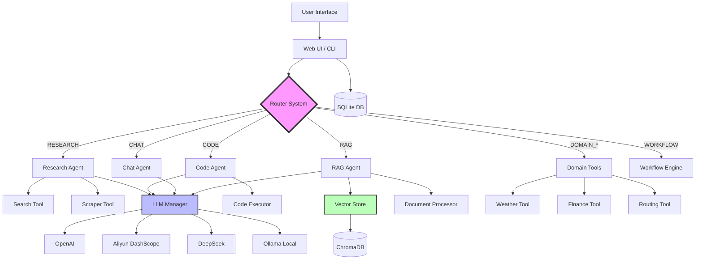

# System Architecture Overview

This file contains a Mermaid diagram of the system architecture.

```mermaid
graph TB
    User[User Interface] --> WebUI[Web UI / CLI]
    WebUI --> Router{Router System}

    Router -->|RESEARCH| ResearchAgent[Research Agent]
    Router -->|CODE| CodeAgent[Code Agent]
    Router -->|CHAT| ChatAgent[Chat Agent]
    Router -->|RAG| RAGAgent[RAG Agent]
    Router -->|DOMAIN_*| DomainTools[Domain Tools]
    Router -->|WORKFLOW| WorkflowEngine[Workflow Engine]

    ResearchAgent --> SearchTool[Search Tool]
    ResearchAgent --> ScraperTool[Scraper Tool]
    ResearchAgent --> LLM[LLM Manager]

    CodeAgent --> CodeExecutor[Code Executor]
    CodeAgent --> LLM

    ChatAgent --> LLM

    RAGAgent --> VectorStore[Vector Store]
    RAGAgent --> DocumentProcessor[Document Processor]
    RAGAgent --> LLM

    DomainTools --> Weather[Weather Tool]
    DomainTools --> Finance[Finance Tool]
    DomainTools --> Routing[Routing Tool]

    LLM --> OpenAI[OpenAI]
    LLM --> DashScope[Aliyun DashScope]
    LLM --> DeepSeek[DeepSeek]
    LLM --> Ollama[Ollama Local]

    VectorStore --> ChromaDB[(ChromaDB)]

    WebUI --> Database[(SQLite DB)]

    style Router fill:#f9f,stroke:#333,stroke-width:4px
    style LLM fill:#bbf,stroke:#333,stroke-width:2px
    style VectorStore fill:#bfb,stroke:#333,stroke-width:2px
```
