# System Architecture Diagrams

This document contains architecture diagrams for the AI Search Engine.

## System Overview

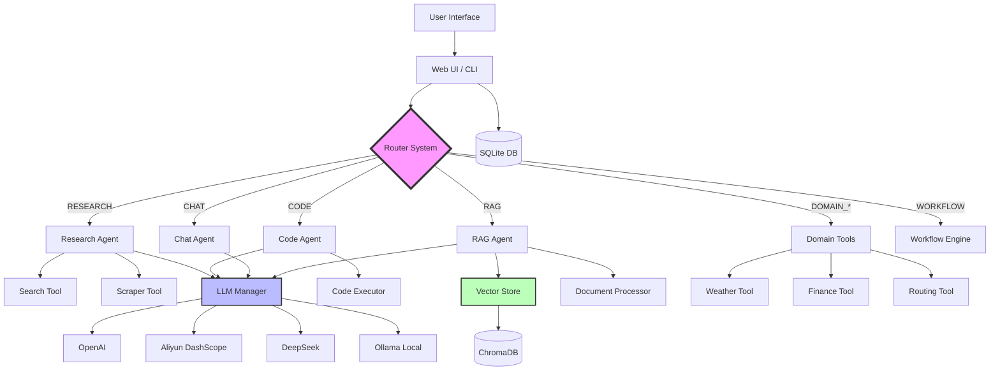

## Routing System Architecture

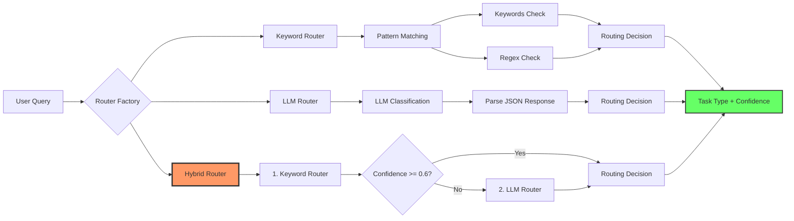

## Research Agent Flow

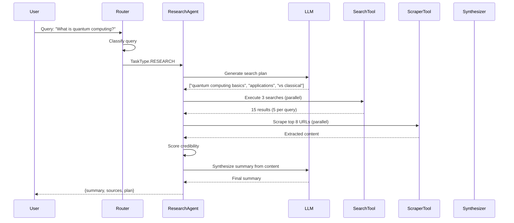

## Code Execution Security (3-Layer)

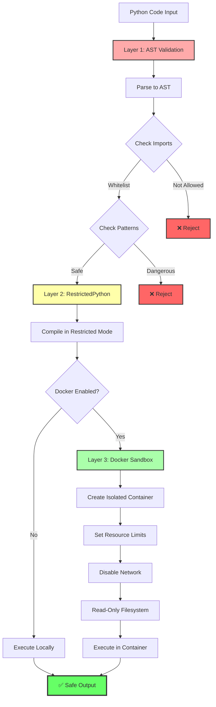

## RAG System Architecture

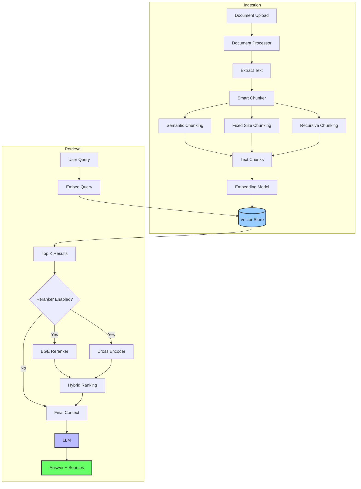

## Web Application Architecture

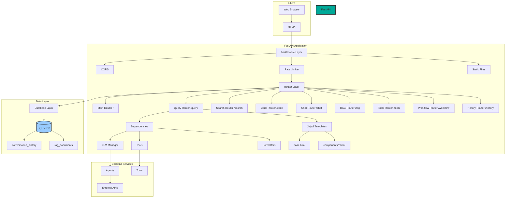

## LLM Manager Fallback

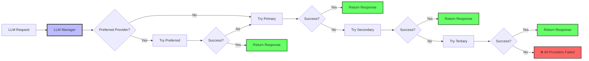

## Workflow Execution Modes

### Sequential Mode

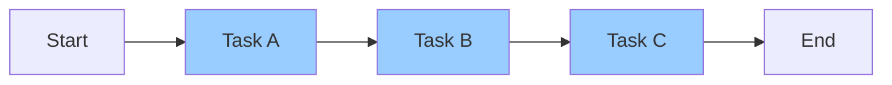

### Parallel Mode

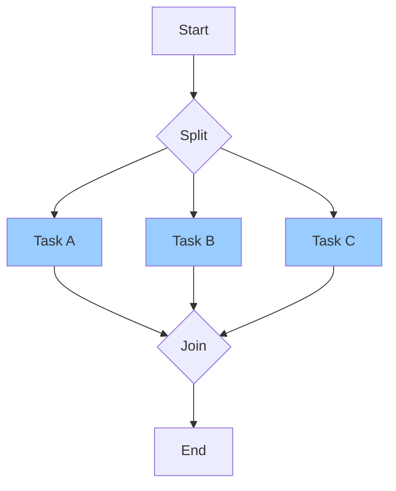

### DAG Mode

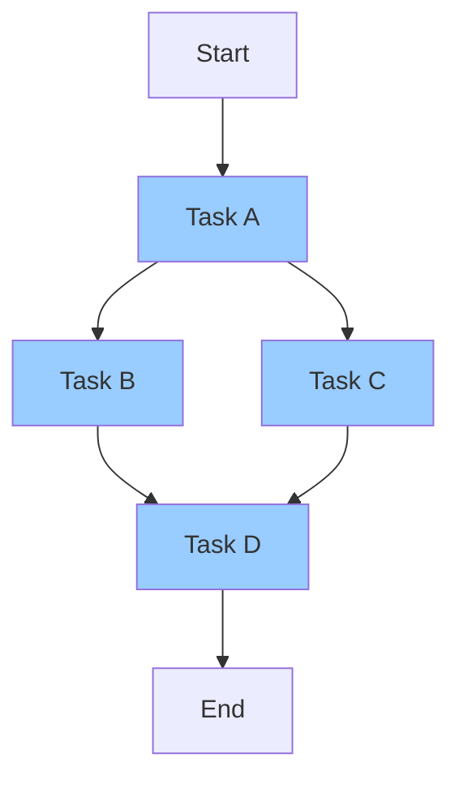

## Caching Strategy

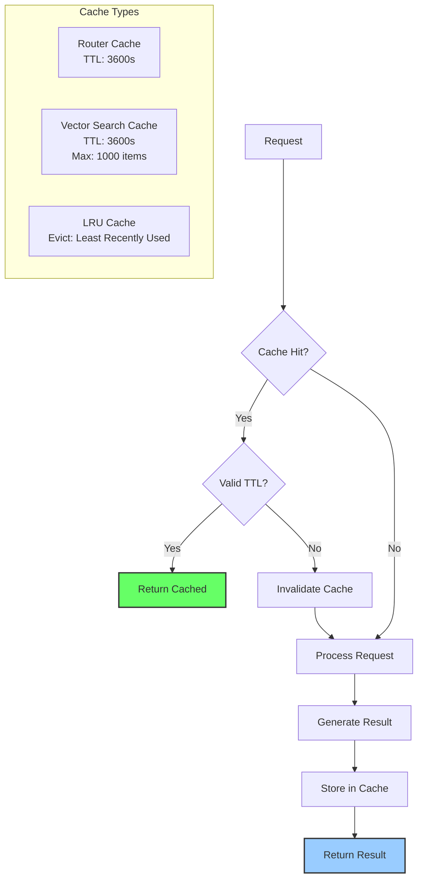

## Data Flow - Complete Query

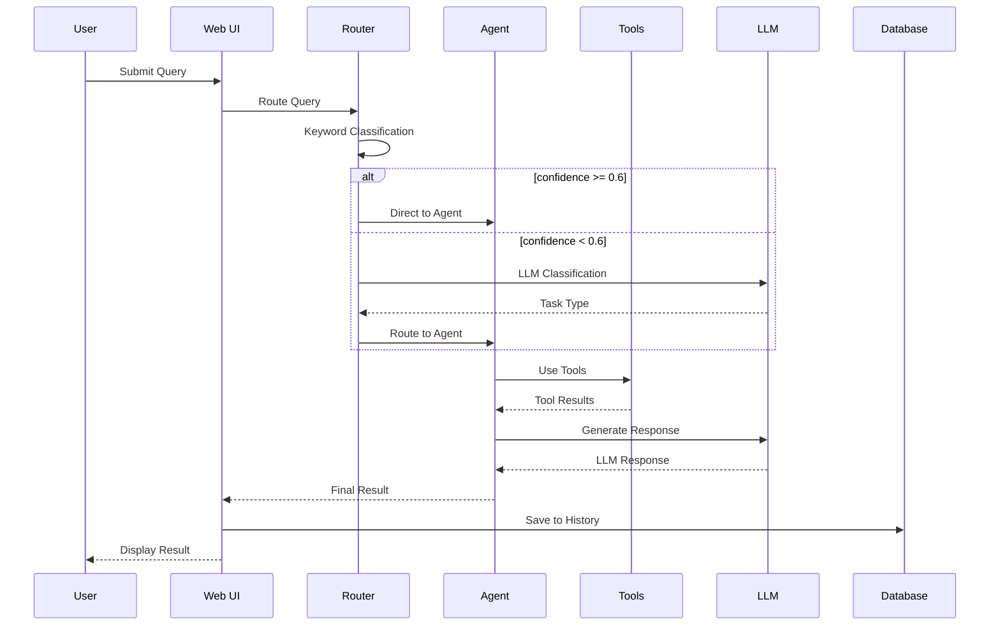

## Module Dependencies

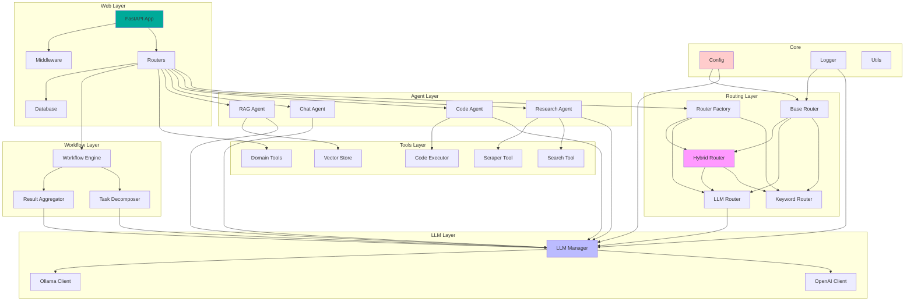

## Deployment Architecture

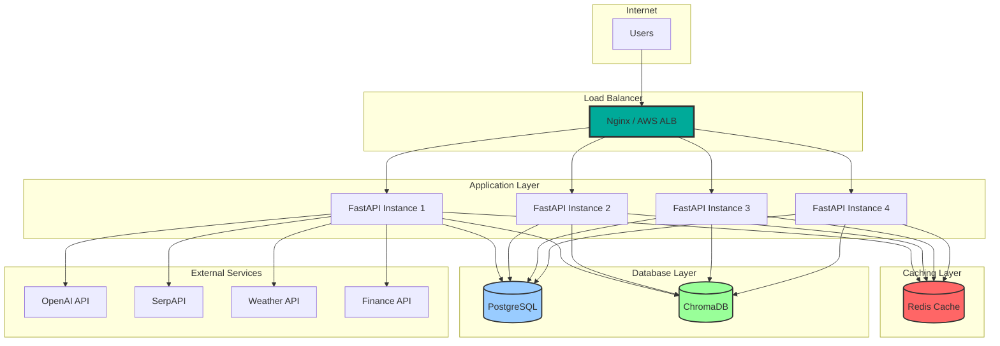
