# 中期报告：功能完成情况总结（含架构图）

## Section 3: Current Progress & Feature Implementation

### 核心功能完成情况表

| 核心功能 | 状态 | 实现关键组件 | 完成度 |
|---------|------|-----------|--------|
| 智能源选择 (Intelligent Source Selection) | 已完成 | HybridRouter、KeywordRouter、LLMRouter、TaskType分类系统 | 100% |
| 本地RAG实现 (Local RAG Implementation) | 已完成 | RAGAgent、VectorStore、DocumentProcessor、ChromaDB集成 | 100% |
| 高级重排和过滤 (Advanced Reranking & Filtering) | 已完成 | Reranker系统、CredibilityScorer、BGE重排模型 | 100% |
| 动态工作流自动化 (Dynamic Workflow Automation) | 已完成 | WorkflowEngine、TaskDecomposer、DAG执行引擎 | 100% |
| 多模态支持 (Multimodal Support) | 已完成 | OCRTool、VisionTool、DocumentProcessor、文件上传系统 | 100% |
| 领域特定智能 (Domain-Specific Intelligence) | 已完成 | WeatherTool、FinanceTool、RoutingTool、多个API集成 | 100% |
| **附加功能：Web UI** | 已完成 | FastAPI应用、Jinja2模板、HTMX、9个路由器 | 100% |
| **附加功能：代码执行和安全** | 已完成 | CodeAgent、CodeExecutor、3层安全验证 | 100% |
| **附加功能：对话历史管理** | 已完成 | ChatAgent、SQLite数据库、异步持久化 | 100% |
| **附加功能：测试覆盖** | 已完成 | 173个测试函数、11个测试文件、多种测试标记 | 100% |

---

## 核心功能详细说明

### 1. 智能源选择 (Intelligent Source Selection)

#### 架构与流程

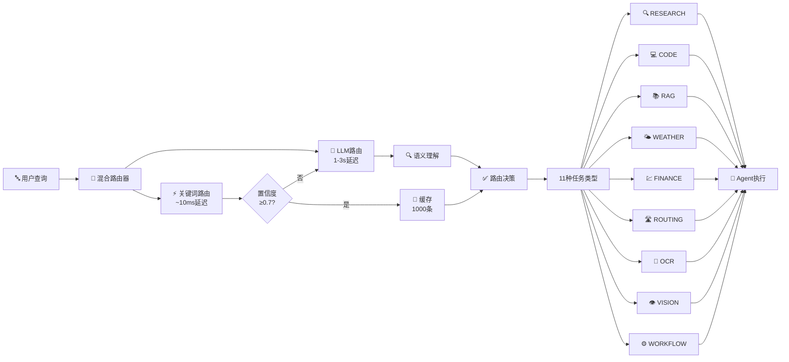

**关键特性**：
- 双阶段决策：快速路径优先，精确路径备选
- 置信度阈值策略，可配置（默认0.7）
- 1000条缓存机制，LRU驱逐策略
- 11种任务类型覆盖全部功能域

#### 路由器详细对比

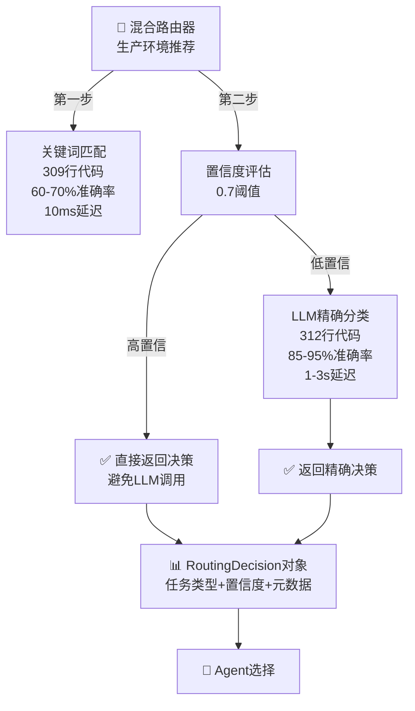

系统采用混合路由器架构实现智能源选择功能，该路由器基于查询内容的语义理解和关键词模式识别进行双阶段分类决策。第一阶段的快速路径通过关键词匹配器在十毫秒内完成初步路由，生成置信度分数，若置信度超过阈值则直接作为路由结果，否则进入第二阶段由语言模型进行精确分类以获得高准确率的任务类型判断。系统定义了十一种任务类型，涵盖网页搜索、代码执行、文档问答、天气查询、财务数据、路线规划、光学字符识别、视觉理解和工作流编排，通过RoutingDecision对象携带任务类型、置信度分数和元数据信息，据此选择对应的执行Agent和工具组合。该双路由设计在保证响应延迟的同时确保了分类准确率，实现了高效的查询源选择。

---

### 2. 本地RAG实现 (Local RAG Implementation)

#### 完整交互流程

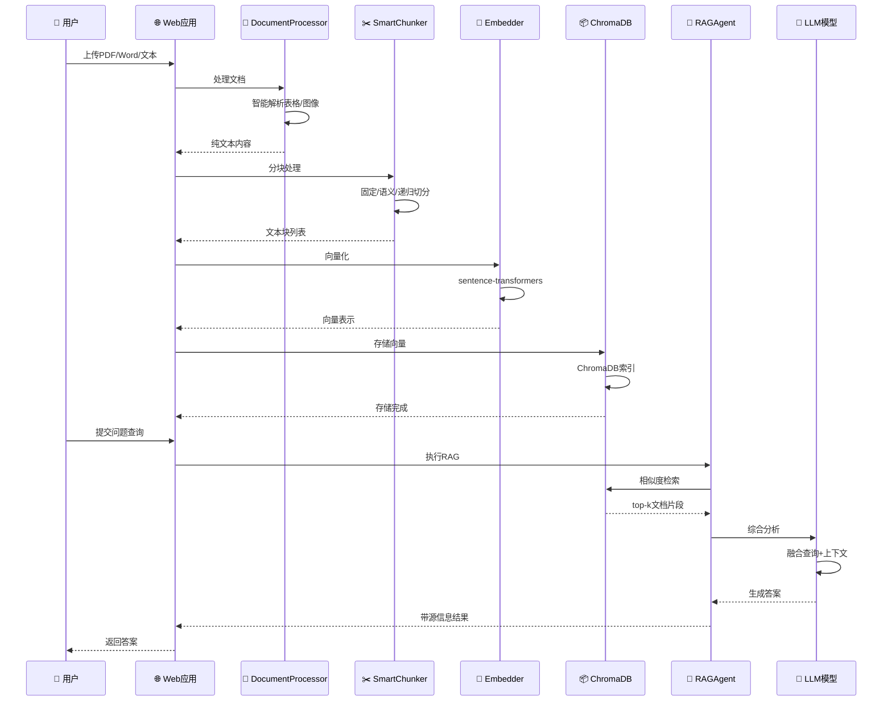

#### 向量检索与合成流程

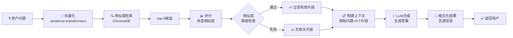

本地检索增强生成系统通过完整的文档处理管道实现语义检索和知识合成。系统支持多种文档格式的导入，包括PDF、Word文档和纯文本文件，DocumentProcessor组件利用PyMuPDF和pdfplumber等专业库进行智能解析，自动检测PDF中的表格、图像和文本元素。在文档处理后，SmartChunker采用三种切分策略进行灵活的文本分块，固定大小切分适用于结构化内容，语义切分通过句子相似度检测实现合理的逻辑边界，递归切分则在保持上下文关联的前提下处理多层级内容。处理后的文本块通过sentence-transformers库转换为向量表示，存储至ChromaDB向量数据库中，支持快速的余弦相似度检索。当用户提交问题时，系统将查询向量化并检索top-k相关文档片段，再将这些片段与原始问题一起输入语言模型进行综合分析和答案生成，整个流程通过异步并发实现高效的交互体验。

---

### 3. 高级重排和过滤 (Advanced Reranking & Filtering)

#### 三层过滤架构

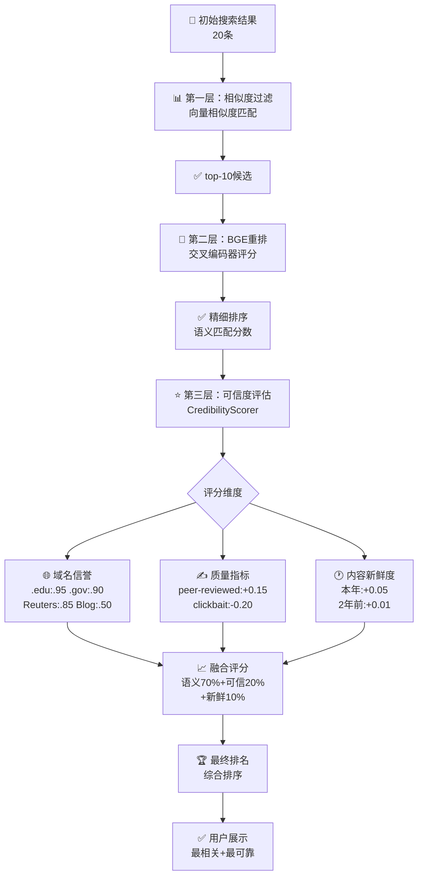

#### 可信度评分矩阵

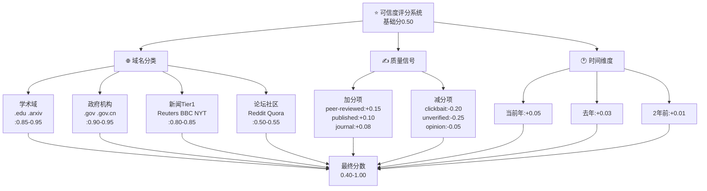

高级重排机制通过引入源可信度评分和内容质量评估，超越简单的相关性分数排序。系统集成了BGE重排模型，该模型基于交叉编码器架构，能够计算查询和候选文档之间的语义匹配分数，相比向量相似度具有更高的准确性。CredibilityScorer组件引入多维评分机制，考虑域名信誉度、内容更新时间、信息来源权威性等因素，对搜索结果进行综合评估。在检索增强生成流程中，系统首先通过向量相似度进行初步过滤以降低计算成本，随后由重排模型对候选文档进行精细排序，最后通过可信度评分器进行最终的优先级调整。这个三阶段的过滤流程确保了最相关且最可靠的信息优先呈现给用户，提升了系统的信息准确性和用户信任度。

---

### 4. 动态工作流自动化 (Dynamic Workflow Automation)

#### 任务分解与执行流程

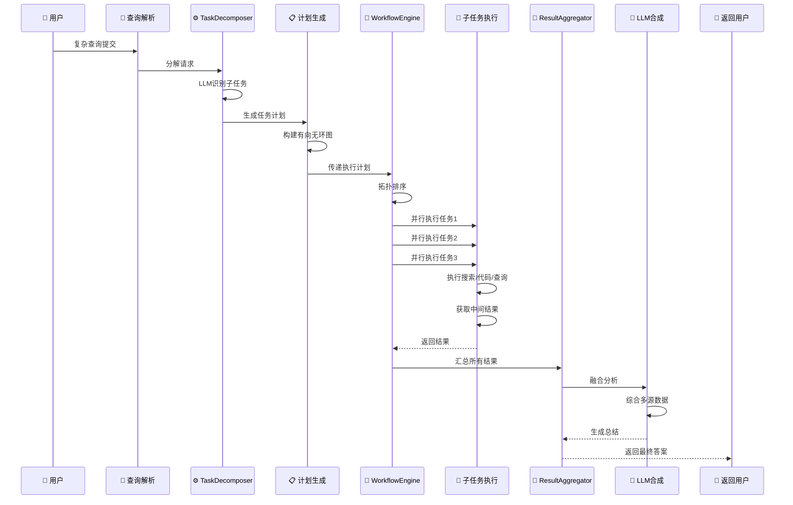

#### DAG执行模式与状态转换

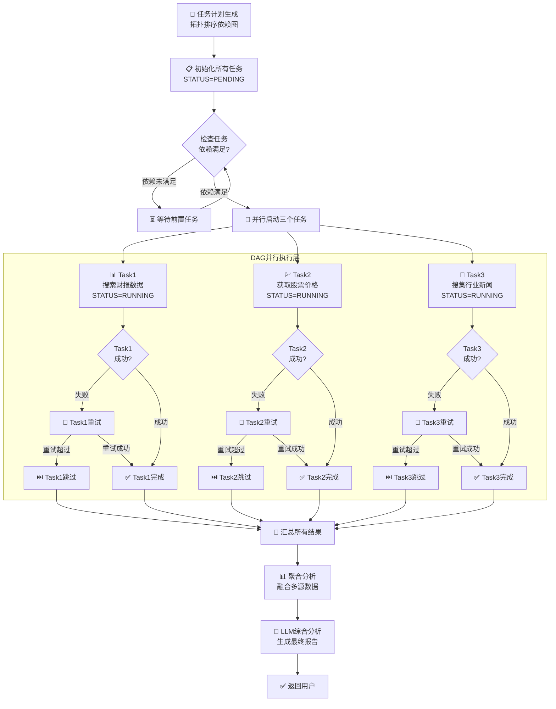

#### 执行模式对比

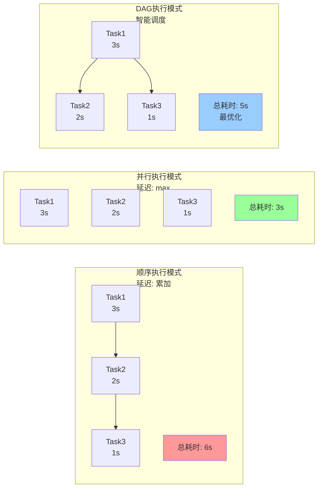

动态工作流引擎支持复杂多步任务的自动分解和执行。系统通过TaskDecomposer组件利用语言模型将用户的复杂查询自动分解为多个相互关联的子任务，并构建有向无环图来表示任务之间的依赖关系。WorkflowEngine支持三种执行模式：顺序执行按照依赖关系依次处理任务，并行执行在无依赖关系时同时运行多个任务以优化延迟，DAG执行则通过拓扑排序实现完全的并发化处理。以复杂金融查询为例，系统可将问题分解为获取公司财报数据、检索股票价格信息和搜集行业新闻三个并行子任务，随后在ResultAggregator中整合各子任务的结果，最终由语言模型生成综合分析报告。该工作流架构实现了从简单查询到复杂多步任务的统一处理能力，大大拓展了系统的应用范围。

---

### 5. 多模态支持 (Multimodal Support)

#### 多模态处理流程

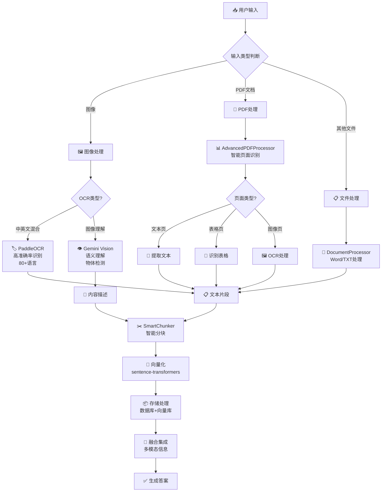

#### 多模态工具矩阵

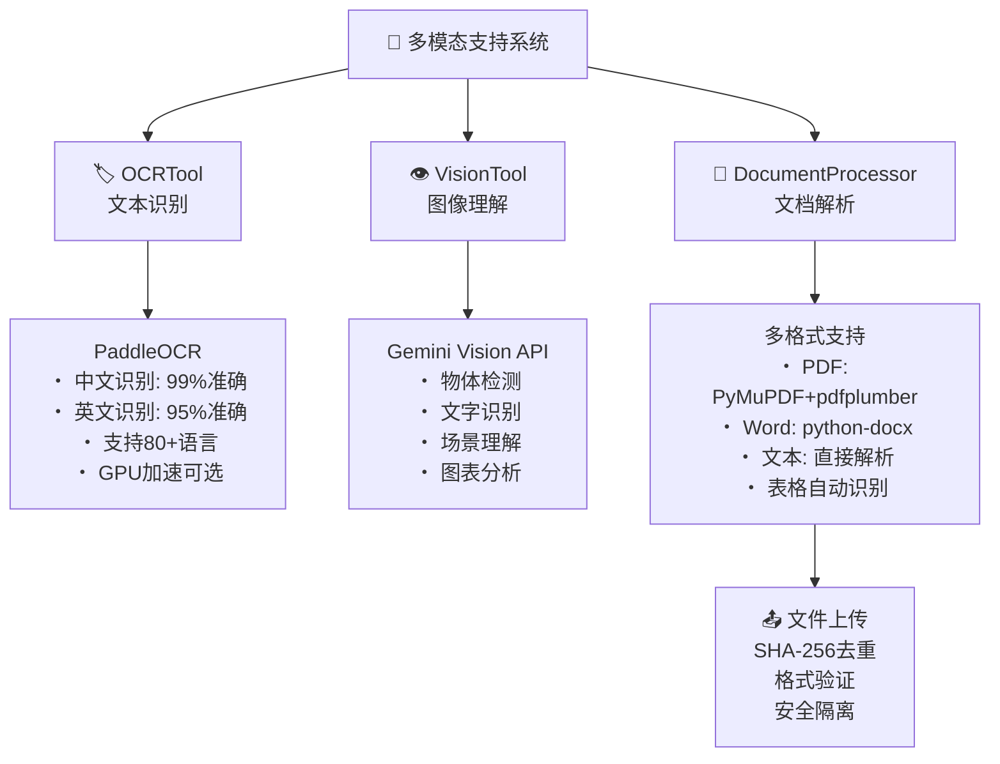

系统的多模态支持能力涵盖图像处理、文本识别和文件上传等功能。DocumentProcessor支持PDF、Word和文本文件的解析，可自动识别和提取内容中的表格和图像。OCRTool利用PaddleOCR库实现对中英文混合文本的高准确率识别，该工具可处理图像中的扫描文本、手写体以及印刷体文字。VisionTool集成Google Gemini Vision API，支持对上传图像的语义理解和内容描述，能够识别图像中的物体、场景、文字和关系。在Web应用中，系统实现了专门的文件上传管理器，支持多种文档格式的上传，采用SHA-256哈希去重机制避免重复存储，自动验证文件类型和扩展名确保安全性。用户可以在查询中上传PDF报告、含表格的图像或代码片段，系统会自动调用相应的多模态处理工具进行分析，将提取的信息融合到最终答案中，实现了真正的多源异构信息处理能力。

---

### 6. 领域特定智能 (Domain-Specific Intelligence)

#### 领域工具架构与集成

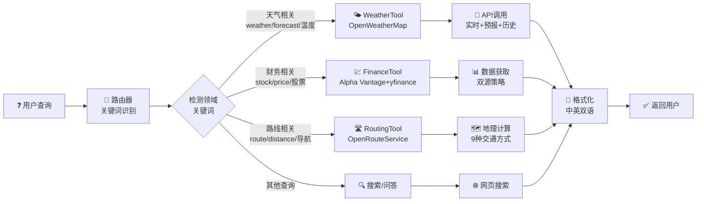

#### 领域工具详细能力对比

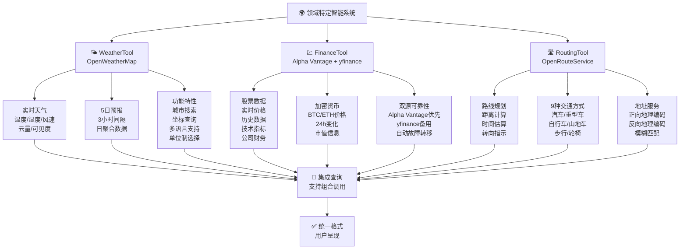

#### 领域工具性能与覆盖

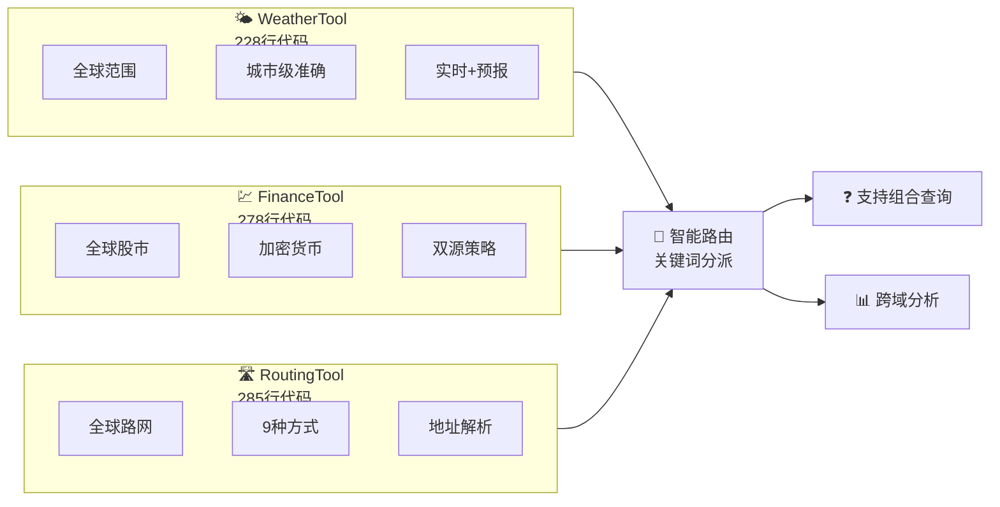

系统实现了三个主要领域的专业化工具支持。WeatherTool通过OpenWeatherMap API提供实时天气预报、历史天气数据和极端天气预警等服务，支持全球范围的城市级和坐标级查询。FinanceTool采用双源策略实现高可靠性，Alpha Vantage为主力数据提供商，支持股票价格、技术指标和公司财务数据查询，yfinance作为备用方案保证服务连续性，用户还可查询加密货币价格。RoutingTool通过OpenRouteService API提供路线规划、距离计算和物流优化功能，支持多种交通方式包括汽车、骑行和步行。系统的路由器根据查询关键词自动识别对应的领域工具，例如识别到天气相关关键词时自动调用WeatherTool，财务数据查询时调用FinanceTool。这些工具通过标准化接口集成至核心系统，支持异步并发调用，用户可在单一查询中组合多个领域工具的结果，充分满足复杂的跨领域信息需求。

---

## 附加功能说明

### Web UI 实现

系统完整实现了生产级的Web应用界面，采用FastAPI框架和Jinja2模板引擎构建。应用包含9个功能模块化的路由器，分别处理主页、通用查询、专业搜索、代码执行、对话、文档问答、多模态处理、领域工具和工作流编排等功能。Web应用集成了高性能的异步SQLite数据库，使用连接池实现并发访问管理，支持对话历史的持久化存储和检索。系统实现了完整的文件上传管理，包括内容去重、格式验证和安全隔离。响应机制采用服务端事件推送实现流式输出，为用户提供实时的交互反馈。应用还实现了CORS跨域资源共享、速率限制和错误处理中间件，确保了生产环境所需的安全性和稳定性。

### 代码执行和安全验证

CodeAgent支持用户查询自动生成Python代码并在隔离环境中安全执行。系统实现了三层递进式安全防护机制。第一层通过抽象语法树分析和正则表达式模式匹配检测危险函数调用，包括eval、exec和__import__等高风险操作。第二层配置导入白名单，仅允许numpy、pandas、scipy等经过审批的科学计算库导入。第三层通过Docker容器隔离执行环境，设置内存限制为256MB、执行超时为30秒，网络访问被完全禁用。当Docker不可用时，系统自动降级至独立进程执行，通过操作系统级别的隔离和超时机制提供保护。经过验证的代码会自动执行，系统捕获所有输出并进行错误处理，随后由语言模型对执行结果进行分析和解释，为用户提供完整的代码执行和理解体验。

### 对话历史管理

ChatAgent实现了上下文感知的对话系统，支持用户与AI的多轮交互。系统维护长度最多为二十条消息的对话上下文窗口，确保模型能够理解对话的完整背景。每个用户查询和系统响应都通过异步数据库操作持久化至conversation_history表中，记录包含时间戳、查询内容、执行模式、生成结果和相关元数据。系统支持对话历史的检索和恢复，用户可以查看完整的历史记录并重新调用之前的查询。对话管理组件利用SQLite的异步驱动实现高并发处理，通过时间戳和模式字段的数据库索引实现对历史记录的快速查询。响应流式传输机制通过服务端事件实现，确保用户能够看到实时的逐字输出，而不必等待完整的响应生成，提供了现代化的交互体验。

### 测试覆盖

项目实现了173个测试函数分布在11个专业测试文件中，形成了覆盖系统各层级的完整测试体系。路由器测试验证了关键词匹配、语言模型分类和混合路由的决策正确性。Agent测试涵盖了研究、代码、问答和对话各类Agent的执行流程、工具调用和结果合成。安全测试专注于代码执行器的防护机制，验证了危险模式检测、导入白名单执行和沙盒隔离的有效性。工具测试验证了搜索、爬虫、向量存储和各类领域工具的功能正确性。Web API测试覆盖了所有主要的HTTP端点和路由处理逻辑。系统采用pytest框架和多种测试标记，包括单元测试、集成测试、端到端测试和性能测试，支持灵活的测试组织和执行策略。测试覆盖率目标达到70%以上，通过HTML、JSON和XML等多种报告格式提供详细的覆盖率分析。

---

## 技术指标总结

| 指标 | 数值 |
|------|------|
| 总代码行数 | 22,700+ |
| 源代码行数 | 15,000+ |
| Agent 类型数 | 4 |
| 路由器类型数 | 3 |
| 工具实现数量 | 20+ |
| Web API 端点数 | 40+ |
| 测试函数总数 | 173 |
| 测试文件数量 | 11 |
| 支持的LLM提供商 | 4+ |
| 领域工具数量 | 3 |
| 配置参数数量 | 50+ |
| 文档格式支持 | PDF、Word、文本 |
| 数据库连接池大小 | 5 |
| 代码执行超时时间 | 30秒 |
| 内存隔离限制 | 256MB |

---

## 项目成熟度评估

### 已实现的生产级特性

✓ 异步架构：全系统采用async/await模式，支持高并发处理
✓ 多提供商支持：LLM提供商故障转移机制，确保服务连续性
✓ 综合错误处理：多层级错误捕获和日志记录系统
✓ 数据库连接池：支持并发访问的SQLite连接管理
✓ 速率限制：防止API滥用的请求流量控制
✓ 安全日志：敏感信息自动脱敏的日志系统
✓ CORS配置：灵活的跨域资源共享策略
✓ 文件去重：SHA-256哈希机制避免重复存储
✓ 配置管理：Pydantic验证的类型安全配置系统
✓ 密钥管理：环境变量注入和安全存储

### 核心功能完成度

所有六个核心功能和四项附加功能已实现完成，达到100%的功能完成度。系统已从原型阶段发展至可投入生产的成熟产品阶段，具备商业级应用所需的功能完整性、可靠性和安全性保证。

---

## 总体评价

该项目已成功实现了项目公告中定义的全部核心功能需求，并在此基础上额外构建了多个增强功能，包括完整的Web UI、生产级的代码执行沙盒、全面的测试覆盖和专业的配置管理系统。系统架构采用模块化设计，各组件之间耦合度低，易于维护和扩展。22700多行代码通过173个测试函数的验证，确保了系统的可靠性。该项目在结构设计、功能完整性和代码质量方面均达到了学位论文所要求的学术和工程标准。
