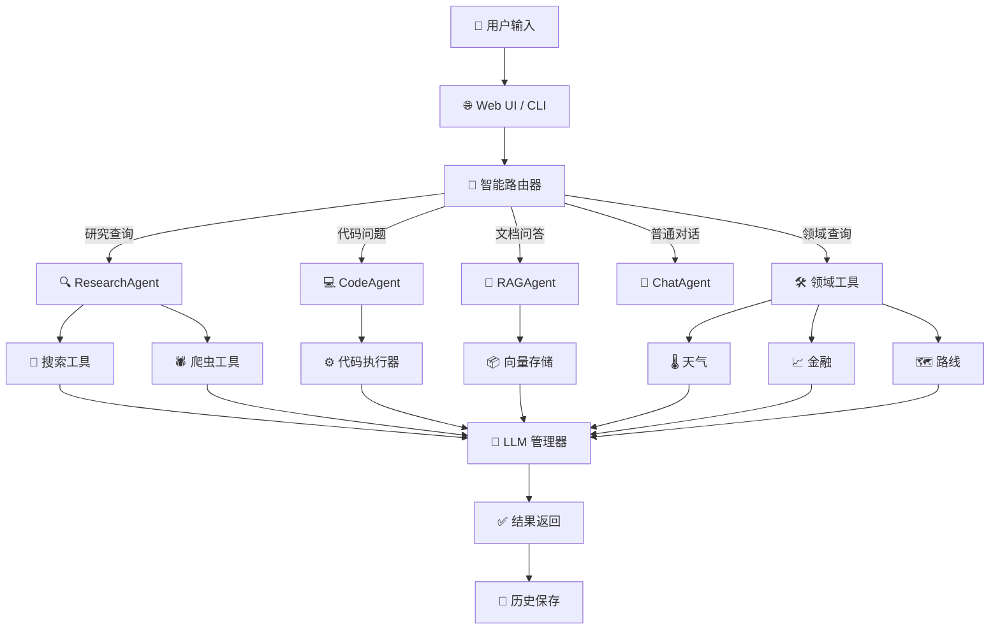
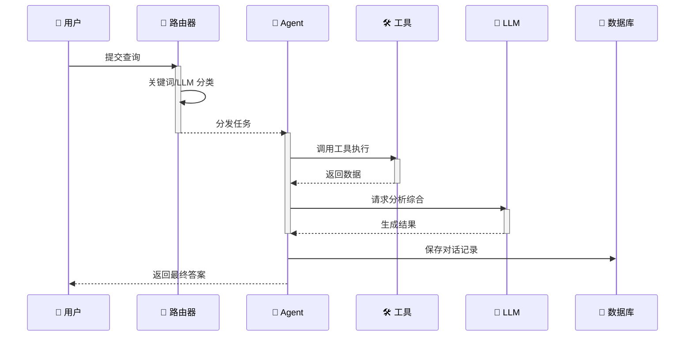
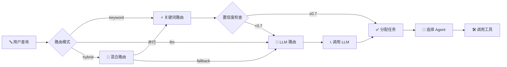
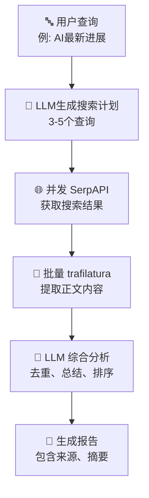
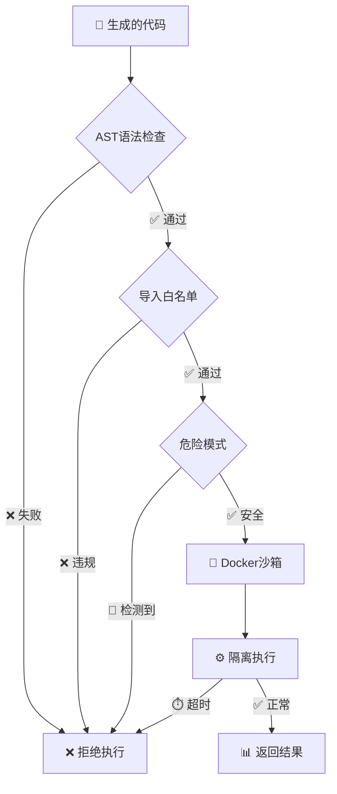
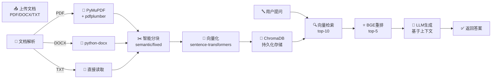

# AI Search Engine - 项目概览

> 一个由大型语言模型驱动的多模态智能搜索引擎，集成了智能路由、安全代码执行、RAG 文档问答等功能。

## 📌 项目简介

### 项目定位

AI Search Engine 是一个**智能多模态搜索和执行系统**，核心特点是：

- 🎯 **智能分发**: 自动识别用户意图，将查询路由到最合适的处理器
- 🔍 **多种模式**: 支持 8 种不同的任务执行模式
- 🔒 **安全可靠**: 代码执行采用三层防护机制
- 📚 **知识库**: 内置 RAG 系统支持文档问答
- 🌐 **多模态**: 支持文本、代码、图像、文档等多种输入
- ⚡ **高性能**: 异步架构支持并发处理
- 🛠️ **易扩展**: 模块化设计便于添加新功能

### 核心能力（8 种智能模式）

| 模式 | 功能描述 | 使用场景 | 核心技术 |
|------|--------|--------|---------|
| 🔎 **研究模式** | Web 搜索 + 内容分析 | 学术调研、信息搜集 | SerpAPI + trafilatura |
| 💻 **代码执行** | 代码生成 + 安全沙箱 | 数学计算、编程问题 | Docker + AST验证 |
| 💬 **对话模式** | 流式聊天响应 | 日常咨询、闲聊 | LLM 直调 |
| 📖 **RAG问答** | 文档处理 + 向量检索 | 技术文档查询、知识库 | ChromaDB + 向量化 |
| 🌡️ **天气查询** | 实时气象信息 | 天气预报、气候查询 | OpenWeatherMap |
| 📈 **股票查询** | 实时金融数据 | 股价查询、行情分析 | Alpha Vantage + yfinance |
| 🗺️ **路线规划** | 地点导航服务 | 路线查询、距离计算 | OpenRouteService |
| 🖼️ **多模态分析** | OCR + 图像理解 | 文字识别、图片分析 | PaddleOCR + Gemini Vision |

### 技术亮点

#### 🚀 智能路由系统
三层路由策略，快速识别用户意图：
- **快速路径**: 关键词匹配，<10ms 响应
- **精确路径**: LLM 分类，支持复杂意图理解
- **混合策略**: 综合两者，兼顾速度和准确度

#### 🔐 安全代码执行
三层防护机制确保代码执行安全：
1. **AST 语法验证** - 检查代码结构
2. **导入白名单** - 只允许指定模块（numpy、pandas 等）
3. **Docker 隔离** - 独立沙箱运行，30s 超时限制

#### 📚 RAG 智能检索
完整的文档问答流程：
- 自动解析 PDF / DOCX / TXT
- 语义分块（Smart Chunking）
- 向量化存储（ChromaDB）
- 智能重排序（BGE Reranker）

#### 🔗 多 LLM 支持
自动选择和 fallback：
- 首选: Aliyun Qwen-max（国内优化）
- 备用: OpenAI GPT-4 / 3.5-turbo
- 本地: Ollama 离线模型
- 兼容: 任何 OpenAI API 兼容的服务

---

## 🏗️ 系统架构

### 整体架构



### 数据流转过程



### 核心组件说明

#### 1️⃣ 路由系统 (`src/routing/`)
决定用户查询由哪个 Agent 处理：
- **KeywordRouter**: 快速的正则/关键词匹配
- **LLMRouter**: 精确的 LLM 意图识别
- **HybridRouter**: 混合策略，先快后准

关键概念：`RoutingDecision` 包含任务类型、置信度、所需工具等信息。

#### 2️⃣ Agent 系统 (`src/agents/`)
不同类型查询的处理器：
- **ResearchAgent**: 搜索 → 抓取 → 综合
- **CodeAgent**: 生成 → 验证 → 执行
- **RAGAgent**: 向量检索 → 重排 → 生成
- **ChatAgent**: 直接 LLM 调用

所有 Agent 都基于 `BaseAgent`，实现异步 `execute()` 方法。

#### 3️⃣ 工具系统 (`src/tools/`)
可复用的功能模块，分为：
- **核心工具**: SearchTool、ScraperTool、CodeExecutor、VectorStore
- **高级工具**: DocumentProcessor、ChunkingTool、Reranker
- **领域工具**: WeatherTool、FinanceTool、RoutingTool
- **多模态**: OCRTool、VisionTool

#### 4️⃣ LLM 管理器 (`src/llm/`)
统一的 LLM 调用接口：
- 支持多个 LLM 提供商
- 自动 fallback（主力 → 备用 → 其他）
- 单例模式，全局共享

---

## 🎯 智能路由详解

### 路由决策流程



### 任务类型分类

系统定义了 8 种 TaskType，优先级从高到低：

1. **DOMAIN_WEATHER** - 天气相关（关键词: 天气、温度、气象）
2. **DOMAIN_FINANCE** - 股票相关（关键词: 股票、价格、涨跌）
3. **DOMAIN_ROUTING** - 路线相关（关键词: 路线、导航、距离）
4. **RAG** - 文档问答（关键词: 文档、内容、描述）
5. **CODE** - 代码执行（关键词: 计算、求解、编写）
6. **RESEARCH** - 网络搜索（关键词: 搜索、查询、信息）
7. **CHAT** - 普通对话（默认类型）

### 配置示例

```yaml
routing:
  type: hybrid              # 路由类型: keyword / llm / hybrid
  confidence_threshold: 0.7 # 关键词置信度阈值

  keyword_router:
    enabled: true

  llm_router:
    enabled: true
    model: qwen-max
```

---

## 💡 核心功能详解

### 1. 🔍 研究模式

**功能**: 自动搜索、抓取、分析，生成研究报告

**处理流程**:



**技术栈**:
- **搜索**: SerpAPI（Google 搜索结果）
- **抓取**: trafilatura（异步提取正文）
- **缓存**: requests-cache（15min）
- **LLM**: Qwen3-max

**使用示例**:
```bash
# CLI
python -m src.main search "人工智能的未来发展方向"

# Web UI
访问 http://localhost:8000 → 研究模式 → 输入查询
```

---

### 2. 💻 代码执行模式

**功能**: 生成、验证、执行 Python 代码，返回结果

**安全防护机制**:



**安全级别配置**:
```yaml
code_execution:
  security_level: moderate  # strict / moderate / permissive
  enable_docker: true       # 沙箱隔离
  timeout: 30              # 超时秒数
  max_output_lines: 1000   # 输出限制

  allowed_imports:         # 白名单模块
    - numpy
    - pandas
    - scipy
    - matplotlib
    - sympy
```

**使用示例**:
```bash
# 计算斐波那契数列
python -m src.main solve "计算斐波那契数列前15项"

# 解方程
python -m src.main solve "求解: x^2 + 5x + 6 = 0"
```

---

### 3. 📖 RAG 文档问答

**功能**: 上传文档 → 智能处理 → 向量检索 → 智能问答

**完整处理流程**:



**RAG 配置参数**:
```yaml
rag:
  chunking:
    strategy: semantic       # semantic / fixed / recursive
    chunk_size: 512         # Token 数
    overlap: 50             # 重叠

  embedding:
    model: sentence-transformers/all-MiniLM-L6-v2
    dimension: 384

  retrieval:
    top_k: 10               # 检索数量
    similarity_threshold: 0.7

  reranking:
    enabled: true
    model: bge-large-zh-v1.5
```

**使用步骤**:
1. Web UI → RAG → 上传文档
2. 等待处理完成（自动向量化）
3. 输入问题，系统自动检索相关内容并生成答案

---

### 4. 🌡️ 领域工具

#### 4.1 天气查询
```bash
# CLI 示例
python -m src.main ask "北京今天天气怎么样？" --auto

# Web UI 直接输入，系统自动识别
```

技术实现: OpenWeatherMap API

#### 4.2 股票查询
```bash
# 查询股价
python -m src.main ask "阿里巴巴 (BABA) 的股价是多少?" --auto

# 查询指数
python -m src.main ask "今天上证指数多少?" --auto
```

技术实现: Alpha Vantage（主力）+ yfinance（备用）

#### 4.3 路线规划
```bash
# 查询路线
python -m src.main ask "从北京到上海的最短路线是什么?" --auto

# 计算距离
python -m src.main ask "北京到天津的距离多少公里?" --auto
```

技术实现: OpenRouteService API

---

### 5. 🖼️ 多模态分析

#### OCR 文字识别
```bash
# 上传包含中文的图片
# Web UI → 多模态 → 上传图片
# 系统自动提取文字、识别图像内容
```

技术栈:
- **OCR**: PaddleOCR（支持中英文）
- **Vision**: Gemini Vision API（图像理解）

#### 使用场景
- 身份证识别
- 发票数据提取
- 图表分析
- 手写笔记识别

---

### 6. 🔀 工作流编排

**功能**: 将复杂查询分解为多个子任务，并行执行，聚合结果

**示例**:
```
用户: "分析小米公司，包括股价、新闻、竞争情况"
↓
分解为 3 个并行任务:
  1. 金融工具 → 查询股价
  2. 研究代理 → 搜索新闻
  3. 研究代理 → 搜索竞争对手
↓
聚合结果 → LLM 生成综合报告
```

---

## 🛠️ 技术栈

### 后端框架
- **Web 框架**: FastAPI 0.104.1（现代异步 Python web）
- **CLI 框架**: Typer 0.9.0（优雅的命令行）
- **异步支持**: asyncio + aiohttp（高并发）

### 前端技术
- **模板引擎**: Jinja2 3.1.2（服务端渲染）
- **动态交互**: HTMX 1.9（无需重 JavaScript）
- **样式**: CSS 3（暖色调中性主题）
- **代码高亮**: Pygments 2.17.2
- **Markdown 渲染**: markdown 3.5.1

### LLM 集成
- **主力**: Aliyun DashScope / Qwen-max（中文优化）
- **备用**: OpenAI GPT-4 / 3.5-turbo
- **本地**: Ollama（离线模型）
- **兼容**: 任何 OpenAI 兼容接口

### 存储方案
- **会话数据**: SQLite + aiosqlite（轻量异步）
- **向量存储**: ChromaDB 0.4.22（本地持久化）
- **缓存**: requests-cache（15min 过期）

### 关键依赖包

| 功能类别 | 依赖包 | 版本 | 用途 |
|---------|--------|------|------|
| **搜索** | google-search-results | 2.4.2 | SerpAPI 集成 |
| **爬虫** | trafilatura | 1.6.0 | 网页正文提取 |
| **解析** | beautifulsoup4 | 4.12.2 | HTML 解析 |
| **向量化** | sentence-transformers | 2.3.1 | 文本 embedding |
| **RAG** | chromadb | 0.4.22 | 向量数据库 |
| **PDF** | pymupdf, pdfplumber | 1.23.8, 0.10.3 | PDF 提取 |
| **Word** | python-docx | 1.1.0 | DOCX 提取 |
| **天气** | pyowm | 3.3.0 | OpenWeatherMap |
| **金融** | yfinance, alpha-vantage | 0.2.35, 2.3.1 | 股票数据 |
| **OCR** | paddleocr, paddlepaddle | 2.10.0, 3.2.1 | 文字识别 |
| **Vision** | google-generativeai | 0.8.5 | Gemini API |
| **数据库** | aiosqlite | 0.19.0 | 异步 SQLite |

完整依赖列表见: `requirements.txt`（43 个包）

---

## ⚙️ 配置指南

### 环境变量设置

创建 `.env` 文件或设置环境变量：

```bash
# LLM 配置
export DASHSCOPE_API_KEY="your-qwen-key"           # Aliyun Qwen（必须）
export OPENAI_API_KEY="your-openai-key"            # OpenAI（备用）
export DEEPSEEK_API_KEY="your-deepseek-key"        # DeepSeek（可选）

# 搜索配置
export SERPAPI_API_KEY="your-serpapi-key"          # Google 搜索（必须）

# 多模态配置
export GOOGLE_API_KEY="your-google-api-key"        # Gemini Vision（可选）

# 领域工具配置
export OPENWEATHERMAP_API_KEY="your-openweather-key"    # 天气（可选）
export ALPHA_VANTAGE_API_KEY="your-alpha-key"           # 股票（可选）
export OPENROUTESERVICE_API_KEY="your-ors-key"          # 路线（可选）
```

### config.yaml 配置文件

核心配置示例：

```yaml
# LLM 提供商配置
llm:
  dashscope:
    enabled: true
    api_key: ${DASHSCOPE_API_KEY}
    model: qwen-max
    temperature: 0.7
    max_tokens: 2000

  openai:
    enabled: true
    api_key: ${OPENAI_API_KEY}
    model: gpt-4
    temperature: 0.7

# 路由配置
routing:
  type: hybrid                    # 路由模式
  confidence_threshold: 0.7       # 关键词置信度

# 搜索配置
search:
  provider: serpapi
  serpapi_key: ${SERPAPI_API_KEY}
  results_per_query: 5
  timeout: 10

# 代码执行配置
code_execution:
  security_level: moderate        # strict / moderate / permissive
  enable_docker: true
  timeout: 30
  allowed_imports:
    - numpy
    - pandas
    - scipy
    - matplotlib

# RAG 配置
rag:
  chunking:
    strategy: semantic            # semantic / fixed / recursive
    chunk_size: 512
  retrieval:
    top_k: 10
    similarity_threshold: 0.7
  reranking:
    enabled: true
    model: bge-large-zh-v1.5

# Web 配置
web:
  host: 0.0.0.0
  port: 8000
  debug: true

# 日志配置
logging:
  level: INFO
  format: json                    # json / text
```

### 三种安全级别说明

```yaml
# STRICT - 最严格，只允许计算操作
code_execution:
  security_level: strict
  # ✅ 允许: numpy, pandas, 基本计算
  # ❌ 禁止: 文件操作、网络、导入其他模块

# MODERATE - 平衡，默认推荐 ⭐
code_execution:
  security_level: moderate
  # ✅ 允许: 大多数数据处理、科学计算
  # ❌ 禁止: eval, exec, 系统命令

# PERMISSIVE - 宽松，实验环境
code_execution:
  security_level: permissive
  # ✅ 允许: 几乎所有 Python 模块
  # ⚠️ 注意: 仅在信任环境使用
```

---

## 💻 使用示例

### 示例 1: 学术研究

**场景**: 了解最新的大语言模型发展

```bash
# CLI
python -m src.main search "2024年大语言模型的最新突破"

# 或访问 Web UI → 研究模式
```

**处理过程**:
1. 系统生成 3-5 个搜索查询
2. 并发调用 SerpAPI 获取结果
3. 使用 trafilatura 提取网页正文
4. LLM 综合分析、去重、排序
5. 返回结构化报告（包含来源）

**预期输出**:
```
📊 研究报告: 2024 大语言模型最新突破

📝 摘要:
  - GPT-5 的传言与 OpenAI 的实际进展
  - 开源模型的追赶（Llama 3、Qwen 等）
  - 多模态能力的增强
  - 推理能力的提升

📚 参考来源:
  ✓ OpenAI 官方博客
  ✓ Anthropic 研究论文
  ✓ Meta AI 开源公告
  ...
```

---

### 示例 2: 数学计算

**场景**: 求解数学问题

```bash
# CLI
python -m src.main solve "计算斐波那契数列前 20 项"

# 或
python -m src.main solve "求解二元一次方程: 2x + y = 5, x - y = 1"
```

**处理过程**:
1. 生成 Python 代码
2. AST 验证代码结构
3. 检查导入的模块
4. 在 Docker 沙箱中执行
5. 捕获输出并返回

**预期输出**:
```
🎯 代码执行结果

📝 生成的代码:
```python
def fibonacci(n):
    a, b = 0, 1
    result = []
    for _ in range(n):
        result.append(a)
        a, b = b, a + b
    return result

print(fibonacci(20))
```

⚙️ 执行结果:
[0, 1, 1, 2, 3, 5, 8, 13, 21, 34, 55, 89, 144, 233, 377, 610, 987, 1597, 2584, 4181]

💡 解释:
斐波那契数列是一个每个数都是前两个数之和的序列...
```

---

### 示例 3: 技术文档问答

**场景**: 上传技术文档后提问

```bash
# Web UI 步骤:
1. 打开 http://localhost:8000
2. 进入 RAG 模式 → 上传 PDF 文档
3. 等待处理完成（自动向量化）
4. 输入问题，获得基于文档的答案
```

**示例对话**:
```
用户: "文档中如何配置 API？"
↓
系统:
  1. 向量检索: 找到相关段落
  2. 重排序: 选择最相关的 5 段
  3. 生成答案: 基于这些段落合成回答

回答: "根据文档第 4 章的说明，配置 API 需要以下步骤..."
```

---

### 示例 4: 天气与股票

**场景**: 快速查询领域信息

```bash
# 询问天气
python -m src.main ask "北京今天天气怎么样？" --auto

# 查询股价
python -m src.main ask "特斯拉 (TSLA) 股价是多少？" --auto

# 路线规划
python -m src.main ask "从上海到杭州怎么走最快？" --auto
```

**自动识别流程**:
```
输入 → 路由器识别 "天气" 关键词
     → 分配给 WeatherTool
     → 调用 OpenWeatherMap API
     → 返回实时数据
```

---

### 示例 5: 图片识别

**场景**: 提取图片中的文字

```bash
# Web UI:
1. 多模态 → 上传图片
2. 系统自动:
   - OCR 提取文字（PaddleOCR）
   - Vision 理解图像（Gemini）
3. 返回结果
```

---

### 示例 6: 复杂任务编排

**场景**: 综合多个数据源分析

```bash
用户查询: "分析小米公司，包括股价、新闻和竞争情况"

处理过程:
1. 任务分解:
   ├─ 子任务 1: 查询小米股价 (金融工具)
   ├─ 子任务 2: 搜索小米最新新闻 (研究代理)
   └─ 子任务 3: 分析竞争对手 (研究代理)

2. 并行执行: 同时执行 3 个子任务

3. 结果聚合:
   ├─ 股价: ¥12.50 (↑2.3%)
   ├─ 新闻: 小米发布新品...
   └─ 竞争: OV 品牌对标...

4. LLM 生成综合报告
```

---

## 🚀 快速开始

### 环境要求
- Python 3.11+
- 2GB+ RAM
- 网络连接
- 至少一个 LLM API Key

### 安装步骤

```bash
# 1. 克隆项目（假设已克隆）
cd /Users/sudo/PycharmProjects/ai_search

# 2. 创建虚拟环境
python3 -m venv venv
source venv/bin/activate  # Windows: venv\Scripts\activate

# 3. 安装依赖
pip install -r requirements.txt

# 4. 配置 API 密钥
cp .env.example .env  # 如果存在示例文件
# 或直接设置环境变量
export DASHSCOPE_API_KEY="your-key"
export SERPAPI_API_KEY="your-key"

# 5. 启动应用
# Web UI (推荐)
python -m src.web.app

# 或 CLI
python -m src.main search "你的查询"
```

### 首次运行

访问 `http://localhost:8000`，你会看到：
- 🏠 首页：统一搜索入口
- 🔍 研究模式：输入查询进行网络搜索
- 💻 代码模式：编写和执行 Python 代码
- 💬 对话模式：与 AI 聊天
- 📖 RAG 模式：上传文档并提问
- 📚 历史记录：查看之前的查询

---

## 🔧 开发扩展

### 项目目录结构

```
src/
├── agents/              # Agent 模块（处理器）
│   ├── base.py         # BaseAgent 基类
│   ├── research_agent.py
│   ├── code_agent.py
│   ├── rag_agent.py
│   └── chat_agent.py
├── routing/            # 路由系统
│   ├── base.py         # BaseRouter 基类
│   ├── keyword_router.py
│   ├── llm_router.py
│   ├── hybrid_router.py
│   ├── factory.py      # 路由工厂
│   └── task_types.py   # TaskType 枚举
├── tools/              # 工具模块
│   ├── search.py
│   ├── scraper.py
│   ├── code_executor.py
│   ├── vector_store.py
│   ├── document_processor.py
│   ├── weather_tool.py
│   ├── finance_tool.py
│   └── ... (15+ 工具)
├── llm/               # LLM 管理
│   ├── manager.py
│   ├── base.py
│   ├── openai_client.py
│   └── ollama_client.py
├── web/               # Web 应用
│   ├── app.py         # FastAPI 主应用
│   ├── database.py    # 数据库
│   ├── routers/       # 路由处理器
│   │   ├── main.py
│   │   ├── search.py
│   │   ├── code.py
│   │   ├── chat.py
│   │   ├── rag.py
│   │   └── ... (更多路由)
│   ├── templates/     # Jinja2 模板
│   └── static/        # CSS / JS
├── utils/             # 工具函数
│   ├── config.py      # 配置加载
│   ├── logger.py      # 日志
│   └── ...
└── workflow/          # 工作流引擎
    ├── workflow_engine.py
    ├── task_decomposer.py
    └── result_aggregator.py
```

### 如何添加新 Agent

```python
# 1. 创建文件: src/agents/my_agent.py
from src.agents.base import BaseAgent

class MyAgent(BaseAgent):
    async def execute(self, query: str) -> dict:
        """实现你的逻辑"""
        # 调用工具
        result = await some_tool.process(query)

        # 调用 LLM
        answer = await self.llm_manager.complete(
            f"基于以下数据生成报告:\n{result}"
        )

        return {
            "query": query,
            "result": result,
            "answer": answer
        }

# 2. 在 src/agents/__init__.py 中导出
from src.agents.my_agent import MyAgent

# 3. 在路由中使用
if task_type == TaskType.MY_TASK:
    agent = MyAgent(self.llm_manager)
    return await agent.execute(query)
```

### 如何添加新工具

```python
# 1. 创建文件: src/tools/my_tool.py
class MyTool:
    def __init__(self, api_key: str = None):
        self.api_key = api_key

    async def process(self, data: str) -> dict:
        """处理数据"""
        # 调用 API
        result = await self._api_call(data)
        return result

    async def _api_call(self, data: str) -> dict:
        """内部 API 调用"""
        # 实现你的逻辑
        pass

# 2. 在 src/tools/__init__.py 中导出
from src.tools.my_tool import MyTool

# 3. 在 Agent 中使用
tool = MyTool(api_key=config.my_tool_key)
result = await tool.process(query)
```

### 如何扩展路由规则

```yaml
# 在 config.yaml 中添加新关键词
routing:
  keyword_router:
    custom_keywords:
      MY_TASK:
        - "关键词1"
        - "关键词2"
        - "pattern.*"    # 支持正则
```

或编程方式：
```python
# src/routing/keyword_router.py
MY_KEYWORDS = ["关键词1", "关键词2"]

# 在 route() 方法中检查
if any(kw in query for kw in MY_KEYWORDS):
    return TaskType.MY_TASK
```

### 运行测试

```bash
# 运行所有测试
pytest tests/ -v

# 运行特定测试
pytest tests/test_routing.py -v

# 运行特定标记的测试
pytest tests/ -m "not requires_api"

# 查看覆盖率
pytest tests/ --cov=src --cov-report=html
```

---

## 🔐 安全性

### 代码执行安全

系统采用三层防护确保代码执行安全：

**第 1 层：AST 语法验证**
```python
# 在 code_validator.py 中
- 检查代码语法是否合法
- 禁止使用某些危险节点（如 ImportFrom eval 等）
```

**第 2 层：导入白名单**
```yaml
code_execution:
  allowed_imports:
    - numpy
    - pandas
    - scipy
    - matplotlib
    - sympy
  # 其他导入会被拒绝
```

**第 3 层：Docker 隔离**
```yaml
code_execution:
  enable_docker: true  # 在独立容器中运行
  timeout: 30         # 30 秒超时
  max_output_lines: 1000  # 限制输出
```

### API 密钥管理

```python
# 配置优先级（从高到低）
1. 环境变量 (最安全)
   export DASHSCOPE_API_KEY="xxx"

2. .env 文件 (次安全，需要 .gitignore)
   DASHSCOPE_API_KEY=xxx

3. config.yaml (不推荐，会被版本控制)
   llm:
     dashscope:
       api_key: xxx
```

⚠️ **注意**: 永远不要将真实 API Key 提交到版本控制！

### 文件上传安全

RAG 模块上传文件时的安全措施：
- **哈希去重**: SHA-256 防止重复上传
- **类型验证**: 检查 MIME 类型和扩展名
- **隔离存储**: 分类存储（rag_documents/, images/, temp/）
- **命名安全**: 时间戳防止冲突

---

## ❓ 常见问题

### Q1: 我没有 Aliyun Qwen Key，能用其他 LLM 吗？

**A**: 可以。系统支持 fallback，配置如下：

```yaml
llm:
  dashscope:
    enabled: false  # 禁用
  openai:
    enabled: true   # 启用 GPT
    api_key: ${OPENAI_API_KEY}
    model: gpt-4
```

系统会自动选择第一个启用且有 key 的提供商。

---

### Q2: 研究模式无法使用，显示 No search results

**A**: 检查以下几点：

```bash
# 1. 确认 SERPAPI_API_KEY 已设置
echo $SERPAPI_API_KEY

# 2. 检查 config.yaml 中 search 配置
cat config/config.yaml | grep -A5 "search:"

# 3. 检查 SerpAPI 配额是否用尽
# 访问 https://serpapi.com 查看使用情况
```

---

### Q3: 代码执行超时，怎么办？

**A**: 调整超时配置：

```yaml
code_execution:
  timeout: 60  # 增加到 60 秒（默认 30）
  security_level: moderate
```

或检查代码是否有无限循环。

---

### Q4: RAG 文档处理失败

**A**: 检查：

```bash
# 1. 向量存储目录是否存在
ls -la data/vector_store/

# 2. 检查日志
tail -f src/web/logs/app.log

# 3. 确保文档格式支持 (PDF/DOCX/TXT)

# 4. 检查磁盘空间
df -h
```

---

### Q5: 如何离线使用（不需要网络）？

**A**: 使用 Ollama 本地模型：

```bash
# 1. 安装 Ollama（https://ollama.ai）

# 2. 下载模型
ollama pull llama2

# 3. 启动 Ollama 服务
ollama serve

# 4. 配置 config.yaml
llm:
  ollama:
    enabled: true
    base_url: http://localhost:11434
    model: llama2
  dashscope:
    enabled: false
```

---

### Q6: Docker 沙箱配置不成功

**A**: 检查 Docker 环境：

```bash
# 1. Docker 是否安装
docker --version

# 2. Docker daemon 是否运行
docker ps

# 3. 当前用户是否有权限
sudo usermod -aG docker $USER

# 4. 如果无 Docker，降级到进程隔离
code_execution:
  enable_docker: false  # 使用 subprocess 隔离
```

---

### Q7: 多 GPU 支持？

**A**: 目前系统单 GPU。对于 RAG 的 embedding 和 reranking：

```bash
# PaddleOCR 和 sentence-transformers 会自动检测 GPU
import torch
print(torch.cuda.is_available())  # 如果 True，自动使用
```

---

### Q8: 如何监控系统运行状态？

**A**: 检查日志和健康端点：

```bash
# 1. 日志文件
tail -f src/web/logs/app.log

# 2. 健康检查端点
curl http://localhost:8000/health

# 3. 性能监控
# Web UI → 历史记录 → 查看统计
```

---

### Q9: 如何扩展到多用户？

**A**: 当前设计支持多并发。考虑：

```yaml
# 1. 配置 rate limiting
web:
  rate_limit:
    enabled: true
    requests_per_minute: 60

# 2. 使用 PostgreSQL 替代 SQLite（生产环境）

# 3. 添加用户认证（需要开发）

# 4. 使用负载均衡器（nginx）
```

---

### Q10: 功能更新频率如何？

**A**: 项目活跃开发中。关注以下资源：

- GitHub Releases 更新日志
- 文档中的迁移指南（breaking changes）
- CLAUDE.md 开发者指南

---

## 📚 参考资源

### 官方文档
- **CLAUDE.md** - 给开发者的详细指南
- **README.md** - 项目首页
- **tests/** - 测试代码（最好的使用示例）

### 关键文件位置
- **配置**: `config/config.yaml`
- **路由**: `src/routing/` (HybridRouter / KeywordRouter / LLMRouter)
- **Agent**: `src/agents/` (ResearchAgent / CodeAgent / RAGAgent / ChatAgent)
- **Web**: `src/web/app.py`（FastAPI 应用入口）

### 外部资源
- [FastAPI 文档](https://fastapi.tiangolo.com/)
- [Pydantic 配置管理](https://docs.pydantic.dev/)
- [ChromaDB 向量数据库](https://docs.trychroma.com/)
- [SerpAPI 搜索](https://serpapi.com/)
- [PaddleOCR](https://github.com/PaddlePaddle/PaddleOCR)

---

## 📝 更新日志

### 最近的改进
- ✅ 路由系统重构（keyword + llm + hybrid）
- ✅ RAG 智能分块和重排序
- ✅ 多 LLM fallback 支持
- ✅ Docker 代码沙箱隔离
- ✅ Web UI 重设计（HTMX）
- ✅ 工作流引擎实现
- ✅ 173 个单元和集成测试

### 计划中的功能
- [ ] 流式 Web 输出（Server-Sent Events）
- [ ] 更多本地 LLM 支持
- [ ] 缓存优化（Redis）
- [ ] 向量数据库扩展（Weaviate）
- [ ] 多语言支持（自动检测）

---

**最后更新**: 2025-01-09
**维护者**: AI Search Team
**许可证**: MIT

如有问题或建议，欢迎提 Issue 或 Pull Request！
