# 高级架构设计 (High-Level Architecture)

## 系统架构概览

```mermaid
flowchart TD
    User["👤 用户查询<br/>User Query"]

    User -->|HTTP Request| WebUI["🌐 Web UI / CLI<br/>query.py<br/>Typer / FastAPI"]

    WebUI -->|Input Query| Router["🎯 智能路由器<br/>HybridRouter<br/>快速识别意图"]

    %% 路由决策流程
    Router -->|Step 1: 快速路由| KR["⚡ 关键词路由器<br/>KeywordRouter<br/>Regex Patterns<br/>~10ms"]

    KR -->|返回决策 + 置信度| Decision{置信度检查<br/>Confidence<br/>Threshold: 0.7}

    Decision -->|✅ 置信度 ≥ 0.7<br/>高置信匹配| Route["✅ 路由决策<br/>RoutingDecision<br/>Task Type Selected"]

    Decision -->|❌ 置信度 < 0.7<br/>需要精准分类| LR["🧠 LLM 路由器<br/>LLMRouter<br/>LLM Classification<br/>精确识别"]

    LR -->|返回精确决策| Route

    %% Agent 分支 - 研究模式
    Route -->|RESEARCH<br/>搜索类查询| RA["🔍 研究 Agent<br/>ResearchAgent<br/>research()"]

    RA -->|LLM Call #1<br/>生成搜索计划| LLM_R1["🧠 LLM Manager<br/>Qwen / GPT<br/>生成3-5个搜索查询"]

    LLM_R1 -->|搜索查询列表| ST["🔎 搜索工具<br/>SearchTool<br/>SerpAPI<br/>并行查询"]

    ST -->|搜索结果| SC["🕷️ 爬虫工具<br/>ScraperTool<br/>trafilatura<br/>并行抓取"]

    SC -->|网页正文内容| LLM_R2["🧠 LLM Manager<br/>综合分析<br/>去重 + 排序"]

    LLM_R2 -->|综合报告<br/>含来源| RA_Output["RA 结果"]

    %% Agent 分支 - 代码模式
    Route -->|CODE<br/>计算/编程| CA["💻 代码 Agent<br/>CodeAgent<br/>solve()"]

    CA -->|LLM Call #1<br/>生成代码| LLM_C1["🧠 LLM Manager<br/>生成 Python 代码"]

    LLM_C1 -->|Python Code| CV["✓ 代码验证器<br/>CodeValidator<br/>AST 语法检查"]

    CV -->|通过检查| CE["⚙️ 代码执行器<br/>CodeExecutor<br/>检查导入白名单"]

    CE -->|导入合法| CE2["🐳 Docker 沙箱<br/>隔离执行<br/>30s 超时限制"]

    CE2 -->|执行结果| LLM_C2["🧠 LLM Manager<br/>解释结果"]

    LLM_C2 -->|代码 + 输出 + 解释| CA_Output["CA 结果"]

    %% Agent 分支 - RAG 模式
    Route -->|RAG<br/>文档问答| RAGA["📖 RAG Agent<br/>RAGAgent<br/>query_rag()"]

    RAGA -->|用户问题| VS["📦 向量存储<br/>VectorStore<br/>ChromaDB<br/>相似度检索<br/>Top-10"]

    VS -->|相关文档段落| RR["⭐ 重排序器<br/>Reranker<br/>BGE Model<br/>精排 Top-5"]

    RR -->|最相关段落| LLM_RAG["🧠 LLM Manager<br/>基于上下文<br/>生成答案"]

    LLM_RAG -->|精准答案| RAG_Output["RAG 结果"]

    %% Agent 分支 - 对话模式
    Route -->|CHAT<br/>普通对话| CHA["💬 对话 Agent<br/>ChatAgent<br/>chat()"]

    CHA -->|LLM Call<br/>直接回复| LLM_CHAT["🧠 LLM Manager<br/>生成对话"]

    LLM_CHAT -->|对话内容<br/>支持流式| CHAT_Output["Chat 结果"]

    %% 领域工具 - 天气
    Route -->|DOMAIN_WEATHER<br/>天气查询| WEATHER["🌡️ 天气工具<br/>WeatherTool<br/>OpenWeatherMap API"]

    WEATHER -->|天气数据<br/>温度/湿度等| WEATHER_Output["Weather 结果"]

    %% 领域工具 - 金融
    Route -->|DOMAIN_FINANCE<br/>股票查询| FINANCE["📈 金融工具<br/>FinanceTool<br/>Alpha Vantage<br/>+ yfinance Fallback"]

    FINANCE -->|股票数据<br/>价格/涨跌| FINANCE_Output["Finance 结果"]

    %% 领域工具 - 路线
    Route -->|DOMAIN_ROUTING<br/>路线规划| ROUTING["🗺️ 路线工具<br/>RoutingTool<br/>OpenRouteService"]

    ROUTING -->|路线数据<br/>距离/时间| ROUTING_Output["Routing 结果"]

    %% 多模态 - 可选
    Route -->|MULTIMODAL<br/>图片分析| MULTI["🖼️ 多模态工具<br/>OCRTool + VisionTool<br/>PaddleOCR<br/>Gemini Vision"]

    MULTI -->|文字 + 描述| MULTI_Output["Multimodal 结果"]

    %% 结果汇聚
    RA_Output --> Agg["📊 结果聚合<br/>Result Aggregation"]
    CA_Output --> Agg
    RAG_Output --> Agg
    CHAT_Output --> Agg
    WEATHER_Output --> Agg
    FINANCE_Output --> Agg
    ROUTING_Output --> Agg
    MULTI_Output --> Agg

    %% 保存到数据库
    Agg -->|格式化结果| DB["💾 数据库<br/>SQLite + aiosqlite<br/>保存对话历史<br/>conversation_history"]

    %% 返回用户
    DB -->|准备响应| Output["📤 输出响应<br/>SSE / HTML<br/>返回给用户"]

    Output --> User

    %% 可选：复杂任务的工作流引擎
    User -.->|🔀 复杂多步任务| WF["🔀 工作流引擎<br/>WorkflowEngine<br/>任务分解 + DAG"]
    WF -->|Decompose into<br/>Subtasks| Router

    %% 样式定义 - 使用提供的配色方案
    %% 最深色 #1B2631 - Router, LLM, Database
    style Router fill:#1B2631,stroke:#0F1419,color:#FFFFFF,stroke-width:3px
    style LLM_R1 fill:#1B2631,stroke:#0F1419,color:#FFFFFF,stroke-width:2px
    style LLM_R2 fill:#1B2631,stroke:#0F1419,color:#FFFFFF,stroke-width:2px
    style LLM_C1 fill:#1B2631,stroke:#0F1419,color:#FFFFFF,stroke-width:2px
    style LLM_C2 fill:#1B2631,stroke:#0F1419,color:#FFFFFF,stroke-width:2px
    style LLM_RAG fill:#1B2631,stroke:#0F1419,color:#FFFFFF,stroke-width:2px
    style LLM_CHAT fill:#1B2631,stroke:#0F1419,color:#FFFFFF,stroke-width:2px
    style DB fill:#1B2631,stroke:#0F1419,color:#FFFFFF,stroke-width:3px

    %% 深色 #2C3E50 - 核心 Agent
    style RA fill:#2C3E50,stroke:#1B2631,color:#FFFFFF,stroke-width:2px
    style CA fill:#2C3E50,stroke:#1B2631,color:#FFFFFF,stroke-width:2px
    style RAGA fill:#2C3E50,stroke:#1B2631,color:#FFFFFF,stroke-width:2px
    style CHA fill:#2C3E50,stroke:#1B2631,color:#FFFFFF,stroke-width:2px

    %% 中深色 #34495E - 工具层
    style ST fill:#34495E,stroke:#2C3E50,color:#FFFFFF,stroke-width:2px
    style SC fill:#34495E,stroke:#2C3E50,color:#FFFFFF,stroke-width:2px
    style CV fill:#34495E,stroke:#2C3E50,color:#FFFFFF,stroke-width:2px
    style CE fill:#34495E,stroke:#2C3E50,color:#FFFFFF,stroke-width:2px
    style CE2 fill:#34495E,stroke:#2C3E50,color:#FFFFFF,stroke-width:2px
    style VS fill:#34495E,stroke:#2C3E50,color:#FFFFFF,stroke-width:2px
    style RR fill:#34495E,stroke:#2C3E50,color:#FFFFFF,stroke-width:2px

    %% 中色 #5D6D7E - 路由决策节点
    style KR fill:#5D6D7E,stroke:#34495E,color:#FFFFFF,stroke-width:2px
    style LR fill:#5D6D7E,stroke:#34495E,color:#FFFFFF,stroke-width:2px
    style Decision fill:#5D6D7E,stroke:#34495E,color:#FFFFFF,stroke-width:2px

    %% 浅色 #AEB6BF - Web UI 层
    style WebUI fill:#AEB6BF,stroke:#85929E,color:#1B2631,stroke-width:2px

    %% 更浅色 #D5DBDB - 中间流程
    style Route fill:#D5DBDB,stroke:#AEB6BF,color:#1B2631,stroke-width:2px
    style Agg fill:#D5DBDB,stroke:#AEB6BF,color:#1B2631,stroke-width:2px
    style RA_Output fill:#D5DBDB,stroke:#AEB6BF,color:#1B2631
    style CA_Output fill:#D5DBDB,stroke:#AEB6BF,color:#1B2631
    style RAG_Output fill:#D5DBDB,stroke:#AEB6BF,color:#1B2631
    style CHAT_Output fill:#D5DBDB,stroke:#AEB6BF,color:#1B2631
    style WEATHER_Output fill:#D5DBDB,stroke:#AEB6BF,color:#1B2631
    style FINANCE_Output fill:#D5DBDB,stroke:#AEB6BF,color:#1B2631
    style ROUTING_Output fill:#D5DBDB,stroke:#AEB6BF,color:#1B2631
    style MULTI_Output fill:#D5DBDB,stroke:#AEB6BF,color:#1B2631

    %% 最浅色 #EBF5FB - 用户输入输出
    style User fill:#EBF5FB,stroke:#D5DBDB,color:#1B2631,stroke-width:3px
    style Output fill:#EBF5FB,stroke:#D5DBDB,color:#1B2631,stroke-width:3px

    %% 领域工具 - 使用中等颜色
    style WEATHER fill:#5D6D7E,stroke:#34495E,color:#FFFFFF,stroke-width:2px
    style FINANCE fill:#5D6D7E,stroke:#34495E,color:#FFFFFF,stroke-width:2px
    style ROUTING fill:#5D6D7E,stroke:#34495E,color:#FFFFFF,stroke-width:2px
    style MULTI fill:#5D6D7E,stroke:#34495E,color:#FFFFFF,stroke-width:2px

    %% 可选工作流引擎
    style WF fill:#85929E,stroke:#5D6D7E,color:#FFFFFF,stroke-width:2px
```



---

## 架构层次说明

### 1️⃣ 输入层 (Input Layer)
- **Web UI / CLI** - 用户交互入口
  - FastAPI 异步 Web 应用
  - Typer 命令行框架
  - 处理 HTTP 请求

### 2️⃣ 路由层 (Routing Layer)
智能查询分类，是系统的关键决策部分。

**HybridRouter 三层策略**：
```
Input Query
    ↓
Step 1: KeywordRouter (快速, ~10ms)
    ├─ 关键词匹配
    ├─ Regex 模式识别
    └─ 返回 RoutingDecision + 置信度
    ↓
Step 2: 置信度检查
    ├─ 置信度 ≥ 0.7 → 返回结果 ✅
    └─ 置信度 < 0.7 → 继续 Step 3
    ↓
Step 3: LLMRouter (精确, ~200-500ms)
    ├─ 调用 LLM 分析
    └─ 返回精确 RoutingDecision
```

**任务类型优先级**（从高到低）：
1. **DOMAIN_WEATHER** - 天气关键词
2. **DOMAIN_FINANCE** - 股票/金融关键词
3. **DOMAIN_ROUTING** - 路线/导航关键词
4. **RAG** - 文档问答关键词
5. **CODE** - 计算/编程关键词
6. **RESEARCH** - 搜索/研究关键词
7. **CHAT** - 默认（任何其他查询）
8. **MULTIMODAL** - 图片分析（可选）

### 3️⃣ Agent 层 (Agent Execution Layer)

#### 🔍 ResearchAgent (研究代理)
```
Input: "2024年AI最新进展"

┌─────────────────────────────────────┐
│ Step 1: LLM 生成搜索计划            │
│ → 3-5 个具体搜索查询                │
├─────────────────────────────────────┤
│ Step 2: 并行执行搜索                │
│ SearchTool (SerpAPI)                │
│ → 获取搜索结果链接                  │
├─────────────────────────────────────┤
│ Step 3: 并行抓取内容                │
│ ScraperTool (trafilatura)           │
│ → 提取每个链接的正文内容            │
├─────────────────────────────────────┤
│ Step 4: LLM 综合分析                │
│ → 去重、排序、生成总结              │
└─────────────────────────────────────┘

Output: 结构化报告 + 来源列表
```

#### 💻 CodeAgent (代码代理)
```
Input: "计算1-100的质数"

┌─────────────────────────────────────┐
│ Step 1: LLM 生成 Python 代码       │
├─────────────────────────────────────┤
│ Step 2: 代码验证                    │
│ CodeValidator (AST 检查)            │
│ ✓ 语法合法                          │
│ ✓ 导入在白名单中                    │
│ ✓ 无危险模式                        │
├─────────────────────────────────────┤
│ Step 3: 沙箱执行                    │
│ CodeExecutor (Docker 隔离)          │
│ • 独立容器运行                      │
│ • 30秒超时限制                      │
│ • 内存/CPU 限制                     │
├─────────────────────────────────────┤
│ Step 4: 结果解释                    │
│ LLM 解释代码和输出                  │
└─────────────────────────────────────┘

Output: 代码 + 执行结果 + 解释
```

#### 📖 RAGAgent (文档问答代理)
```
Input: "如何配置API？"（已上传文档）

┌─────────────────────────────────────┐
│ Step 1: 向量检索                    │
│ VectorStore (ChromaDB)              │
│ → 相似度搜索                        │
│ → 返回 Top-10 相关片段              │
├─────────────────────────────────────┤
│ Step 2: 智能重排                    │
│ Reranker (BGE Model)                │
│ → 精排序 Top-5                      │
│ → 去除冗余                          │
├─────────────────────────────────────┤
│ Step 3: LLM 生成答案                │
│ → 基于这5段上下文                   │
│ → 生成精准回答                      │
└─────────────────────────────────────┘

Output: 精准答案 + 相关片段引用
```

#### 💬 ChatAgent (对话代理)
```
Input: "今天天气如何？" (普通对话)

┌─────────────────────────────────────┐
│ 直接 LLM 调用                       │
│ → 生成对话内容                      │
│ → 支持流式响应 (SSE)               │
└─────────────────────────────────────┘

Output: 自然对话
```

### 4️⃣ 工具层 (Tool Layer)

#### 核心工具
- **SearchTool** - SerpAPI 搜索
- **ScraperTool** - trafilatura 内容抓取
- **CodeExecutor** - Docker 代码执行
- **VectorStore** - ChromaDB 向量存储
- **Reranker** - BGE 结果重排序

#### 领域工具
- **WeatherTool** - OpenWeatherMap API
- **FinanceTool** - Alpha Vantage + yfinance
- **RoutingTool** - OpenRouteService

#### 多模态工具
- **OCRTool** - PaddleOCR 文字识别
- **VisionTool** - Gemini Vision 图像理解

### 5️⃣ LLM 层 (LLM Management Layer)

**LLMManager** - 统一 LLM 接口

**多提供商支持与自动 Fallback**：
```
优先级顺序：

1️⃣ Preferred Provider
   ├─ 通常是 Aliyun Qwen (性价比高)
   └─ 如果失败或无key，继续

2️⃣ Primary Provider
   ├─ 通常是 OpenAI GPT (功能全)
   └─ 如果失败或无key，继续

3️⃣ Remaining Providers
   ├─ DeepSeek
   ├─ Ollama (本地)
   └─ 其他兼容接口

最终：返回第一个可用的 Provider 的结果
```

### 6️⃣ 存储层 (Storage Layer)

**SQLite + aiosqlite**
- 异步数据库操作
- 轻量级、无需服务器
- 快速本地存储

**数据表**：
- `conversation_history` - 对话记录
- `rag_documents` - RAG 文档元数据
- `vector_store/` - ChromaDB 向量库

### 7️⃣ 输出层 (Output Layer)

**返回格式**：
- **Web UI** - HTML 模板 + 流式 SSE
- **CLI** - 富文本格式 (Rich)
- **API** - JSON 响应

---

## 关键流程示例

### 🔍 完整查询流程（Research 模式）

```
时间轴：T0 → T1 → T2 → T3 → T4 → T5

T0: 用户输入
    "2024 年人工智能最新突破"
    ↓

T1: 路由决策 (~50ms)
    Input → HybridRouter
    ├─ KeywordRouter: "搜索" 关键词匹配 ✓
    ├─ 置信度: 0.95 (>= 0.7)
    └─ TaskType: RESEARCH ✅
    ↓

T2: Agent 执行 (~2-3s)
    ResearchAgent.research()
    ├─ LLM 生成: ["最新AI模型", "大模型进展", ...]
    ├─ SearchTool 并行查询 (~1s)
    ├─ ScraperTool 并行抓取 (~1s)
    └─ LLM 综合分析 (~0.5s)
    ↓

T3: 数据库保存 (~10ms)
    → conversation_history
    ↓

T4: 模板渲染 (~50ms)
    Markdown → HTML
    ↓

T5: SSE 返回 (~100ms)
    客户端收到完整响应
    ↓

总耗时: 2.2-3.2 秒
```

### 💻 代码执行流程（Code 模式）

```
T0: 用户输入
    "计算 1-100 的质数"
    ↓

T1: 路由 (~30ms)
    TaskType: CODE ✅
    ↓

T2: Agent 执行 (~1s)
    CodeAgent.solve()
    ├─ LLM 生成 Python 代码
    ├─ CodeValidator 验证
    │  ├─ AST 检查 ✓
    │  ├─ 导入检查 ✓
    │  └─ 模式检查 ✓
    ├─ CodeExecutor 执行
    │  └─ Docker 沙箱 (30s 超时)
    └─ LLM 解释结果
    ↓

T3: 保存 + 返回 (~50ms)
    ↓

总耗时: 1-1.5 秒
```

### 📖 RAG 查询流程

```
前置准备：
  用户上传 PDF → 解析 → 分块 → 向量化 → 存储

查询时：

T0: "文档中如何配置API？"
    ↓

T1: 路由 (~30ms)
    TaskType: RAG ✅
    ↓

T2: Agent 执行 (~300-500ms)
    RAGAgent.query_rag()
    ├─ VectorStore.search()
    │  ├─ 向量相似度计算 (~100ms)
    │  └─ 返回 Top-10 文段
    ├─ Reranker.rerank()
    │  ├─ BGE 精排 (~100ms)
    │  └─ 返回 Top-5 文段
    └─ LLM 生成答案 (~100-200ms)
    ↓

T3: 保存 + 返回 (~50ms)
    ↓

总耗时: 0.5-1 秒
```

---

## 配色方案说明

本架构图使用深灰蓝到浅蓝的渐变色配色：

```
最深 ━━━━━━━━━━━━━━━━━━━━━━━━ 最浅

#1B2631 (最深)
  ├─ Router 核心决策
  ├─ LLM 管理器
  └─ 数据库存储

#2C3E50 (深)
  └─ Agent 执行引擎

#34495E (中深)
  └─ Tool 工具层

#5D6D7E (中)
  ├─ 路由检查节点
  └─ 领域工具

#AEB6BF (浅)
  └─ Web UI 输入

#D5DBDB (更浅)
  ├─ 中间流程
  └─ 结果输出

#EBF5FB (最浅)
  ├─ 用户输入
  └─ 最终输出
```

**配色寓意**：
- 越深的颜色 = 越核心的系统组件
- 越浅的颜色 = 越靠近用户的交互界面
- 清晰的色阶体现了系统的分层架构

---

## 可选：工作流引擎 (WorkflowEngine)

对于**复杂多步任务**，系统可选启用 WorkflowEngine：

```
复杂查询：
"分析小米公司，包括股价、新闻、竞争分析"
    ↓

WorkflowEngine 分解：
├─ Task 1: 查询小米股价 (金融工具)
├─ Task 2: 搜索最新新闻 (研究代理)
└─ Task 3: 分析竞争对手 (研究代理)
    ↓

DAG 执行：
├─ Task 1 和 2 并行 (不依赖)
├─ Task 3 可能依赖 Task 1/2 的结果
└─ 等待所有 Task 完成
    ↓

ResultAggregator 聚合结果
    ↓

LLM 生成综合报告
```

---

## 性能指标

| 查询类型 | 路由耗时 | 执行耗时 | 总耗时 | 备注 |
|---------|---------|---------|--------|------|
| **天气查询** | 30ms | 500ms | 0.5s | API 直调 |
| **股票查询** | 30ms | 300ms | 0.3s | 最快 |
| **代码执行** | 30ms | 1000ms | 1.0s | 取决于代码复杂度 |
| **RAG 查询** | 30ms | 500ms | 0.5s | 需要预先向量化 |
| **对话** | 30ms | 1000ms | 1.0s | 取决于 LLM 响应速度 |
| **研究模式** | 50ms | 3000ms | 3.0s | 最慢，涉及网络抓取 |
| **复杂工作流** | 50ms | 5000ms | 5.0s | DAG 并行优化 |

> **注意**：耗时数据为估值，实际耗时取决于网络、LLM 提供商、系统负载等因素

---

## 总结

这个架构设计遵循以下原则：

✅ **分层清晰** - 输入 → 路由 → Agent → Tool → LLM → 存储 → 输出

✅ **智能路由** - 快速 + 精准的双路由策略

✅ **并发友好** - 异步架构，Tool 并行执行，多 LLM Provider fallback

✅ **安全可靠** - 代码执行三层防护，Docker 隔离，API key 管理

✅ **易于扩展** - 模块化设计，轻松添加新 Agent、Tool、Provider

✅ **用户友好** - Web UI + CLI，支持流式响应，完整历史记录

---

**最后更新**: 2025-01-09
**配色方案**: ['#1B2631', '#2C3E50', '#34495E', '#5D6D7E', '#85929E', '#AEB6BF', '#D5DBDB', '#EBF5FB']
