## Mid-term Progress Feedback

### Team Overview

**Team name: **???

**Team members:**

| Name       | ID       |
| ---------- | -------- |
| Xu, Zeling | 21214680 |
|            |          |
|            |          |
|            |          |
|            |          |

### System Design & Architecture

#### High-Level Architecture Diagram

本系统采用分层模块化架构，以智能路由为核心决策机制。该架构通过四类专用 Agent 处理不同类型的查询任务，构建统一的任务执行管道。各类查询首先经过智能分类模块进行任务类型识别，随后被分配至相应的 Agent 执行。该设计兼顾灵活性与效率：简单查询由领域工具直接处理以降低延迟，复杂查询则通过多步处理流程、并行工具调用和结果综合获得高质量输出。

```mermaid
flowchart LR
    User["👤 用户查询<br/>User Query"]

    User -->|HTTP Request| WebUI["🌐 Web UI / CLI<br/>query.py<br/>Typer / FastAPI"]

    WebUI -->|Input Query| Router["🎯 智能路由器<br/>HybridRouter<br/>快速识别意图"]

    %% 路由决策流程
    Router -->|Step 1: 快速路由| KR["⚡ 关键词路由器<br/>KeywordRouter<br/>Regex Patterns<br/>~10ms"]

    KR -->|返回决策 + 置信度| Decision{置信度检查<br/>Confidence<br/>Threshold: 0.7}

    Decision -->|✅ 置信度 ≥ 0.7<br/>高置信匹配| Route["✅ 路由决策<br/>RoutingDecision<br/>Task Type Selected"]

    Decision -->|❌ 置信度 < 0.7<br/>需要精准分类| LR["🧠 LLM 路由器<br/>LLMRouter<br/>LLM Classification<br/>精确识别"]

    LR -->|返回精确决策| Route

    %% Agent 分支 - 研究模式
    Route -->|RESEARCH<br/>搜索类查询| RA["🔍 研究 Agent<br/>ResearchAgent<br/>research()"]

    RA -->|LLM Call #1<br/>生成搜索计划| LLM_R1["🧠 LLM Manager<br/>Qwen / GPT<br/>生成3-5个搜索查询"]

    LLM_R1 -->|搜索查询列表| ST["🔎 搜索工具<br/>SearchTool<br/>SerpAPI<br/>并行查询"]

    ST -->|搜索结果| SC["🕷️ 爬虫工具<br/>ScraperTool<br/>trafilatura<br/>并行抓取"]

    SC -->|网页正文内容| LLM_R2["🧠 LLM Manager<br/>综合分析<br/>去重 + 排序"]

    LLM_R2 -->|综合报告<br/>含来源| RA_Output["RA 结果"]

    %% Agent 分支 - 代码模式
    Route -->|CODE<br/>计算/编程| CA["💻 代码 Agent<br/>CodeAgent<br/>solve()"]

    CA -->|LLM Call #1<br/>生成代码| LLM_C1["🧠 LLM Manager<br/>生成 Python 代码"]

    LLM_C1 -->|Python Code| CV["✓ 代码验证器<br/>CodeValidator<br/>AST 语法检查"]

    CV -->|通过检查| CE["⚙️ 代码执行器<br/>CodeExecutor<br/>检查导入白名单"]

    CE -->|导入合法| CE2["🐳 Docker 沙箱<br/>隔离执行<br/>30s 超时限制"]

    CE2 -->|执行结果| LLM_C2["🧠 LLM Manager<br/>解释结果"]

    LLM_C2 -->|代码 + 输出 + 解释| CA_Output["CA 结果"]

    %% Agent 分支 - RAG 模式
    Route -->|RAG<br/>文档问答| RAGA["📖 RAG Agent<br/>RAGAgent<br/>query_rag()"]

    RAGA -->|用户问题| VS["📦 向量存储<br/>VectorStore<br/>ChromaDB<br/>相似度检索<br/>Top-10"]

    VS -->|相关文档段落| RR["⭐ 重排序器<br/>Reranker<br/>BGE Model<br/>精排 Top-5"]

    RR -->|最相关段落| LLM_RAG["🧠 LLM Manager<br/>基于上下文<br/>生成答案"]

    LLM_RAG -->|精准答案| RAG_Output["RAG 结果"]

    %% Agent 分支 - 对话模式
    Route -->|CHAT<br/>普通对话| CHA["💬 对话 Agent<br/>ChatAgent<br/>chat()"]

    CHA -->|LLM Call<br/>直接回复| LLM_CHAT["🧠 LLM Manager<br/>生成对话"]

    LLM_CHAT -->|对话内容<br/>支持流式| CHAT_Output["Chat 结果"]

    %% 领域工具 - 天气
    Route -->|DOMAIN_WEATHER<br/>天气查询| WEATHER["🌡️ 天气工具<br/>WeatherTool<br/>OpenWeatherMap API"]

    WEATHER -->|天气数据<br/>温度/湿度等| WEATHER_Output["Weather 结果"]

    %% 领域工具 - 金融
    Route -->|DOMAIN_FINANCE<br/>股票查询| FINANCE["📈 金融工具<br/>FinanceTool<br/>Alpha Vantage<br/>+ yfinance Fallback"]

    FINANCE -->|股票数据<br/>价格/涨跌| FINANCE_Output["Finance 结果"]

    %% 领域工具 - 路线
    Route -->|DOMAIN_ROUTING<br/>路线规划| ROUTING["🗺️ 路线工具<br/>RoutingTool<br/>OpenRouteService"]

    ROUTING -->|路线数据<br/>距离/时间| ROUTING_Output["Routing 结果"]

    %% 多模态 - 可选
    Route -->|MULTIMODAL<br/>图片分析| MULTI["🖼️ 多模态工具<br/>OCRTool + VisionTool<br/>PaddleOCR<br/>Gemini Vision"]

    MULTI -->|文字 + 描述| MULTI_Output["Multimodal 结果"]

    %% 结果汇聚
    RA_Output --> Agg["📊 结果聚合<br/>Result Aggregation"]
    CA_Output --> Agg
    RAG_Output --> Agg
    CHAT_Output --> Agg
    WEATHER_Output --> Agg
    FINANCE_Output --> Agg
    ROUTING_Output --> Agg
    MULTI_Output --> Agg

    %% 保存到数据库
    Agg -->|格式化结果| DB["💾 数据库<br/>SQLite + aiosqlite<br/>保存对话历史<br/>conversation_history"]

    %% 返回用户
    DB -->|准备响应| Output["📤 输出响应<br/>SSE / HTML<br/>返回给用户"]

    Output --> User

    %% 可选：复杂任务的工作流引擎
    User -.->|🔀 复杂多步任务| WF["🔀 工作流引擎<br/>WorkflowEngine<br/>任务分解 + DAG"]
    WF -->|Decompose into<br/>Subtasks| Router

    %% 样式定义 - 使用提供的配色方案
    %% 最深色 #1B2631 - Router, LLM, Database
    style Router fill:#1B2631,stroke:#0F1419,color:#FFFFFF,stroke-width:3px
    style LLM_R1 fill:#1B2631,stroke:#0F1419,color:#FFFFFF,stroke-width:2px
    style LLM_R2 fill:#1B2631,stroke:#0F1419,color:#FFFFFF,stroke-width:2px
    style LLM_C1 fill:#1B2631,stroke:#0F1419,color:#FFFFFF,stroke-width:2px
    style LLM_C2 fill:#1B2631,stroke:#0F1419,color:#FFFFFF,stroke-width:2px
    style LLM_RAG fill:#1B2631,stroke:#0F1419,color:#FFFFFF,stroke-width:2px
    style LLM_CHAT fill:#1B2631,stroke:#0F1419,color:#FFFFFF,stroke-width:2px
    style DB fill:#1B2631,stroke:#0F1419,color:#FFFFFF,stroke-width:3px

    %% 深色 #2C3E50 - 核心 Agent
    style RA fill:#2C3E50,stroke:#1B2631,color:#FFFFFF,stroke-width:2px
    style CA fill:#2C3E50,stroke:#1B2631,color:#FFFFFF,stroke-width:2px
    style RAGA fill:#2C3E50,stroke:#1B2631,color:#FFFFFF,stroke-width:2px
    style CHA fill:#2C3E50,stroke:#1B2631,color:#FFFFFF,stroke-width:2px

    %% 中深色 #34495E - 工具层
    style ST fill:#34495E,stroke:#2C3E50,color:#FFFFFF,stroke-width:2px
    style SC fill:#34495E,stroke:#2C3E50,color:#FFFFFF,stroke-width:2px
    style CV fill:#34495E,stroke:#2C3E50,color:#FFFFFF,stroke-width:2px
    style CE fill:#34495E,stroke:#2C3E50,color:#FFFFFF,stroke-width:2px
    style CE2 fill:#34495E,stroke:#2C3E50,color:#FFFFFF,stroke-width:2px
    style VS fill:#34495E,stroke:#2C3E50,color:#FFFFFF,stroke-width:2px
    style RR fill:#34495E,stroke:#2C3E50,color:#FFFFFF,stroke-width:2px

    %% 中色 #5D6D7E - 路由决策节点
    style KR fill:#5D6D7E,stroke:#34495E,color:#FFFFFF,stroke-width:2px
    style LR fill:#5D6D7E,stroke:#34495E,color:#FFFFFF,stroke-width:2px
    style Decision fill:#5D6D7E,stroke:#34495E,color:#FFFFFF,stroke-width:2px

    %% 浅色 #AEB6BF - Web UI 层
    style WebUI fill:#AEB6BF,stroke:#85929E,color:#1B2631,stroke-width:2px

    %% 更浅色 #D5DBDB - 中间流程
    style Route fill:#D5DBDB,stroke:#AEB6BF,color:#1B2631,stroke-width:2px
    style Agg fill:#D5DBDB,stroke:#AEB6BF,color:#1B2631,stroke-width:2px
    style RA_Output fill:#D5DBDB,stroke:#AEB6BF,color:#1B2631
    style CA_Output fill:#D5DBDB,stroke:#AEB6BF,color:#1B2631
    style RAG_Output fill:#D5DBDB,stroke:#AEB6BF,color:#1B2631
    style CHAT_Output fill:#D5DBDB,stroke:#AEB6BF,color:#1B2631
    style WEATHER_Output fill:#D5DBDB,stroke:#AEB6BF,color:#1B2631
    style FINANCE_Output fill:#D5DBDB,stroke:#AEB6BF,color:#1B2631
    style ROUTING_Output fill:#D5DBDB,stroke:#AEB6BF,color:#1B2631
    style MULTI_Output fill:#D5DBDB,stroke:#AEB6BF,color:#1B2631

    %% 最浅色 #EBF5FB - 用户输入输出
    style User fill:#EBF5FB,stroke:#D5DBDB,color:#1B2631,stroke-width:3px
    style Output fill:#EBF5FB,stroke:#D5DBDB,color:#1B2631,stroke-width:3px

    %% 领域工具 - 使用中等颜色
    style WEATHER fill:#5D6D7E,stroke:#34495E,color:#FFFFFF,stroke-width:2px
    style FINANCE fill:#5D6D7E,stroke:#34495E,color:#FFFFFF,stroke-width:2px
    style ROUTING fill:#5D6D7E,stroke:#34495E,color:#FFFFFF,stroke-width:2px
    style MULTI fill:#5D6D7E,stroke:#34495E,color:#FFFFFF,stroke-width:2px

    %% 可选工作流引擎
    style WF fill:#85929E,stroke:#5D6D7E,color:#FFFFFF,stroke-width:2px
```

用户查询输入后由混合路由器进行分类处理，该路由器采用两层决策策略。第一层通过关键词匹配实现快速分类，当置信度达到阈值时直接返回路由决策；当置信度不足时执行第二层的语言模型分类以获取精确的任务类型判断。确定任务类型后，对应 Agent 启动执行流程，协调工具调用与模型推理。所有执行结果经过聚合后进入数据库持久化，最后通过流式传输返回用户。该架构通过代码执行隔离机制保证安全性，通过多语言模型提供商的自适应选择保证可靠性，实现了查询处理的最优路径规划。

#### Technology Stack

**后端框架** 本系统采用 FastAPI 作为 Web 应用框架，其异步特性支持高并发请求处理。Typer 框架提供命令行接口功能，aiohttp 库实现异步 HTTP 通信，共同构成了系统的输入输出层。

**数据库与向量存储** 对话历史数据采用 SQLite 结合 aiosqlite 异步驱动进行存储，实现轻量级的本地数据持久化。文档问答任务所需的向量存储采用 ChromaDB，支持语义向量检索与高效相似度计算。

**核心语言模型与 API** 系统集成多个语言模型提供商以实现自适应选择。Aliyun Qwen 系列模型作为主力选择，OpenAI GPT 系列作为备用方案，DeepSeek 和 Ollama 提供额外的可选性。该多提供商架构通过自动故障转移机制保证服务的连续性和可靠性。

**关键依赖库** 如表1所示，系统依赖的关键库涵盖网页搜索、文本处理、向量化、文档解析、多模态分析和领域数据获取等多个方面。

| 功能模块           | 核心库                | 版本   | 用途                 |
| ------------------ | --------------------- | ------ | -------------------- |
| **网页搜索与抽取** | google-search-results | 2.4.2  | SerpAPI 搜索集成     |
|                    | trafilatura           | 1.6.0  | 网页正文提取         |
|                    | beautifulsoup4        | 4.12.2 | HTML 解析            |
| **向量化与重排**   | sentence-transformers | 2.3.1  | 文本向量化           |
|                    | chromadb              | 0.4.22 | 向量数据库           |
|                    | transformers          | 4.37.2 | BGE 重排模型         |
| **代码执行隔离**   | Docker                | -      | 容器隔离             |
|                    | ast                   | -      | 代码安全验证         |
| **文档处理**       | pymupdf               | 1.23.8 | PDF 解析             |
|                    | pdfplumber            | 0.10.3 | PDF 表格提取         |
|                    | python-docx           | 1.1.0  | Word 文档解析        |
| **数据处理**       | pandas                | 1.5.0  | 数据操作             |
|                    | numpy                 | 1.24.0 | 数值计算             |
| **多模态分析**     | paddleocr             | 2.10.0 | 文字识别             |
|                    | paddlepaddle          | 3.2.1  | OCR 计算后端         |
|                    | google-generativeai   | 0.8.5  | Gemini Vision API    |
| **领域数据**       | pyowm                 | 3.3.0  | OpenWeatherMap API   |
|                    | alpha-vantage         | 2.3.1  | Alpha Vantage API    |
|                    | yfinance              | 0.2.35 | Yahoo Finance API    |
|                    | openrouteservice      | 2.3.3  | OpenRouteService API |
| **异步与数据库**   | aiosqlite             | 0.19.0 | 异步 SQLite          |
|                    | aiohttp               | 3.9.0  | 异步 HTTP            |
| **配置与日志**     | pydantic              | 2.5.0  | 配置验证             |
|                    | pyyaml                | 6.0.1  | YAML 配置解析        |

#### Data Flow

用户查询首先进入混合路由器，该路由器接收原始查询字符串并执行两阶段分类。第一阶段通过关键词匹配器快速生成路由决策及其置信度得分，若置信度超过0.7阈值，该决策直接作为路由结果进行缓存并传递；若置信度不足，则进入第二阶段由语言模型进行精确分类。路由决策包含任务类型、置信度分数和元数据，据此系统选择对应的执行函数。以研究任务为例，数据流经历四个处理阶段：第一阶段，查询字符串通过语言模型转化为结构化搜索计划，生成3到5个具体搜索查询；第二阶段，搜索查询列表并行提交至搜索API，返回搜索结果集合；第三阶段，顶部搜索结果的URL列表并行传入网页爬虫工具，提取并清理网页正文内容；第四阶段，原始查询、搜索结果和爬取内容的多源数据再次聚合提交至语言模型进行综合分析，生成最终的结构化报告，包含查询内容、搜索计划、信息来源和综合总结。

系统采用全异步处理架构，各阶段的工具调用实现并行执行以优化延迟。数据在各处理阶段经过变换但保持可追踪性：原始字符串逐步转化为列表、字典等结构化格式，最终聚合为包含多个字段的结果对象。所有执行结果经由异步数据库层持久化至SQLite数据库的对话历史表，其中记录包括时间戳、查询内容、执行模式、生成结果和相关元数据。数据持久化后通过服务端事件推送机制以流式传输方式返回给用户，实现实时的交互响应。该数据流设计确保了系统的高效性、可观测性和可靠的数据管理。

### Current Progress & Feature Implementation

#### Overview

| 核心功能                                        | 状态   | 实现关键组件                                             | 遇到问题                                                     |
| ----------------------------------------------- | ------ | -------------------------------------------------------- | ------------------------------------------------------------ |
| 智能源选择 (Intelligent Source Selection)       | 已完成 | HybridRouter、KeywordRouter、LLMRouter、TaskType分类系统 | NA                                                           |
| 本地RAG实现 (Local RAG Implementation)          | 已完成 | RAGAgent、VectorStore、DocumentProcessor、ChromaDB集成   | 当前embedding模型只支持英文，换大模型会出现计算效率下降的情况 |
| 高级重排和过滤 (Advanced Reranking & Filtering) | 已完成 | Reranker系统、CredibilityScorer、BGE重排模型             | NA                                                           |
| 动态工作流自动化 (Dynamic Workflow Automation)  | 已完成 | WorkflowEngine、TaskDecomposer、DAG执行引擎              | NA                                                           |
| 多模态支持 (Multimodal Support)                 | 已完成 | OCRTool、VisionTool、DocumentProcessor、文件上传系统     | PaddleOCR只支持图像中的文本识别并不能够像VLM那样子能够理解图片内容，如果部署VLM耗费资源 |
| 领域特定智能 (Domain-Specific Intelligence)     | 已完成 | WeatherTool、FinanceTool、RoutingTool、多个API集成       | API限额，并且当前没有集成到WEB主页面路由中                   |
| **附加功能：Web UI**                            | 已完成 | FastAPI应用、Jinja2模板、HTMX、9个路由器                 | NA                                                           |
| **附加功能：代码执行和安全**                    | 已完成 | CodeAgent、CodeExecutor、3层安全验证                     | NA                                                           |
| **附加功能：对话历史管理**                      | 已完成 | ChatAgent、SQLite数据库、异步持久化                      | NA                                                           |
| **附加功能：测试覆盖**                          | 已完成 | 173个测试函数、11个测试文件、多种测试标记                | NA                                                           |

#### 功能详细说明

##### 智能源选择 (Intelligent Source Selection)

系统采用混合路由器架构实现智能源选择功能，该路由器基于查询内容的语义理解和关键词模式识别进行双阶段分类决策。第一阶段的快速路径通过关键词匹配器在十毫秒内完成初步路由，生成置信度分数，若置信度超过阈值则直接作为路由结果，否则进入第二阶段由语言模型进行精确分类以获得高准确率的任务类型判断。系统定义了十一种任务类型，涵盖网页搜索、代码执行、文档问答、天气查询、财务数据、路线规划、光学字符识别、视觉理解和工作流编排，通过RoutingDecision对象携带任务类型、置信度分数和元数据信息，据此选择对应的执行Agent和工具组合。该双路由设计在保证响应延迟的同时确保了分类准确率，实现了高效的查询源选择。

###### 架构与流程

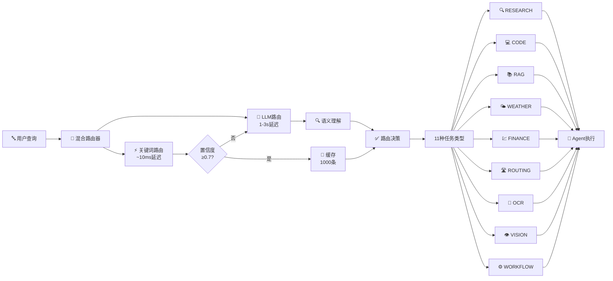

**关键特性**：

- 双阶段决策：快速路径优先，精确路径备选
- 置信度阈值策略，可配置（默认0.7）
- 1000条缓存机制，LRU驱逐策略
- 11种任务类型覆盖全部功能域

###### 路由器详细对比

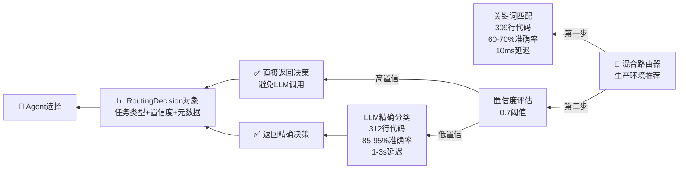

##### 本地RAG实现 (Local RAG Implementation)

本地检索增强生成系统通过完整的文档处理管道实现语义检索和知识合成。系统支持多种文档格式的导入，包括PDF、Word文档和纯文本文件，DocumentProcessor组件利用PyMuPDF和pdfplumber等专业库进行智能解析，自动检测PDF中的表格、图像和文本元素。在文档处理后，SmartChunker采用三种切分策略进行灵活的文本分块，固定大小切分适用于结构化内容，语义切分通过句子相似度检测实现合理的逻辑边界，递归切分则在保持上下文关联的前提下处理多层级内容。处理后的文本块通过sentence-transformers库转换为向量表示，存储至ChromaDB向量数据库中，支持快速的余弦相似度检索。当用户提交问题时，系统将查询向量化并检索top-k相关文档片段，再将这些片段与原始问题一起输入语言模型进行综合分析和答案生成，整个流程通过异步并发实现高效的交互体验。

###### 完整交互流程

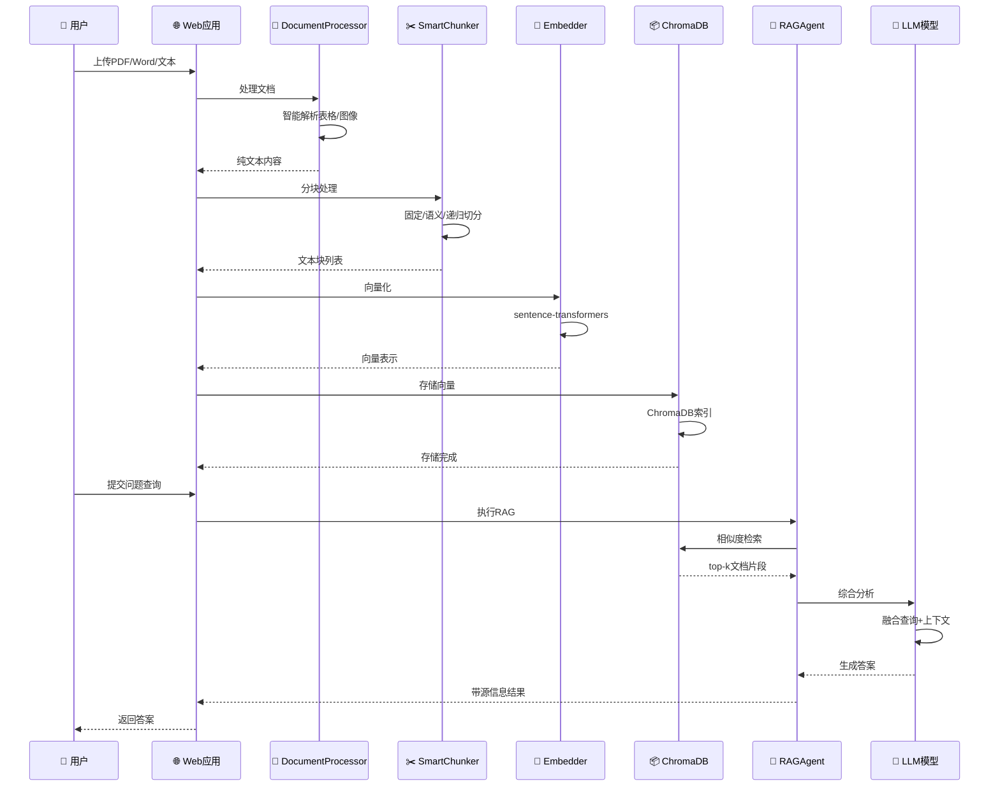

###### 向量检索与合成流程

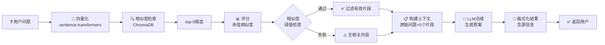

##### 高级重排和过滤 (Advanced Reranking & Filtering)

高级重排机制通过引入源可信度评分和内容质量评估，超越简单的相关性分数排序。系统集成了BGE重排模型，该模型基于交叉编码器架构，能够计算查询和候选文档之间的语义匹配分数，相比向量相似度具有更高的准确性。CredibilityScorer组件引入多维评分机制，考虑域名信誉度、内容更新时间、信息来源权威性等因素，对搜索结果进行综合评估。在检索增强生成流程中，系统首先通过向量相似度进行初步过滤以降低计算成本，随后由重排模型对候选文档进行精细排序，最后通过可信度评分器进行最终的优先级调整。这个三阶段的过滤流程确保了最相关且最可靠的信息优先呈现给用户，提升了系统的信息准确性和用户信任度。

###### 三层过滤架构

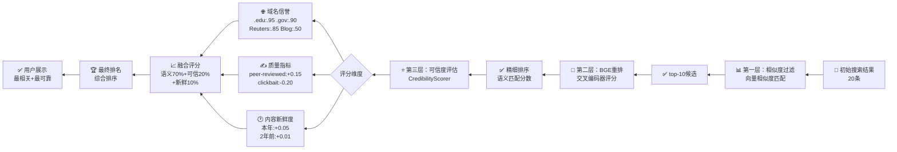

###### 可信度评分矩阵

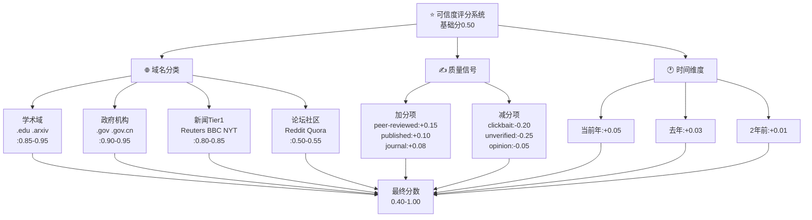

##### 动态工作流自动化 (Dynamic Workflow Automation)

动态工作流引擎支持复杂多步任务的自动分解和执行。系统通过TaskDecomposer组件利用语言模型将用户的复杂查询自动分解为多个相互关联的子任务，并构建有向无环图来表示任务之间的依赖关系。WorkflowEngine支持三种执行模式：顺序执行按照依赖关系依次处理任务，并行执行在无依赖关系时同时运行多个任务以优化延迟，DAG执行则通过拓扑排序实现完全的并发化处理。以复杂金融查询为例，系统可将问题分解为获取公司财报数据、检索股票价格信息和搜集行业新闻三个并行子任务，随后在ResultAggregator中整合各子任务的结果，最终由语言模型生成综合分析报告。该工作流架构实现了从简单查询到复杂多步任务的统一处理能力，大大拓展了系统的应用范围。

###### 任务分解与执行流程

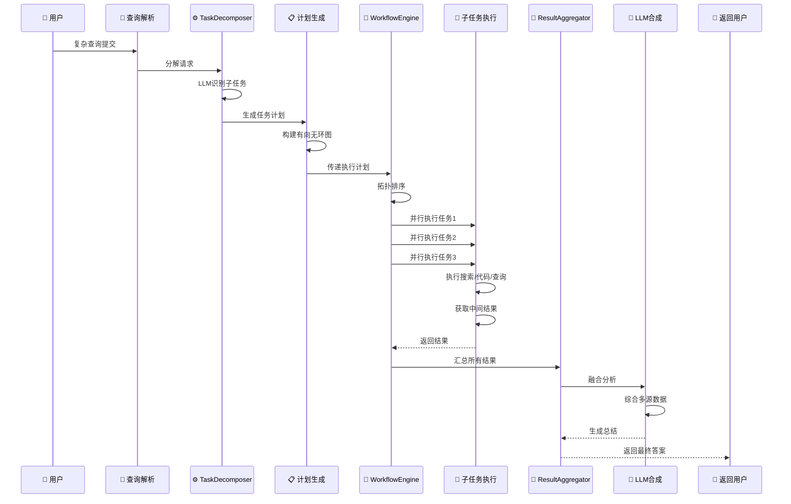

###### DAG执行模式与状态转换

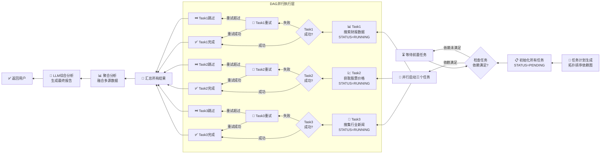

##### 多模态支持 (Multimodal Support)

系统的多模态支持能力涵盖图像处理、文本识别和文件上传等功能。DocumentProcessor支持PDF、Word和文本文件的解析，可自动识别和提取内容中的表格和图像。OCRTool利用PaddleOCR库实现对中英文混合文本的高准确率识别，该工具可处理图像中的扫描文本、手写体以及印刷体文字。VisionTool集成Google Gemini Vision API，支持对上传图像的语义理解和内容描述，能够识别图像中的物体、场景、文字和关系。在Web应用中，系统实现了专门的文件上传管理器，支持多种文档格式的上传，采用SHA-256哈希去重机制避免重复存储，自动验证文件类型和扩展名确保安全性。用户可以在查询中上传PDF报告、含表格的图像或代码片段，系统会自动调用相应的多模态处理工具进行分析，将提取的信息融合到最终答案中，实现了真正的多源异构信息处理能力。

###### 多模态处理流程

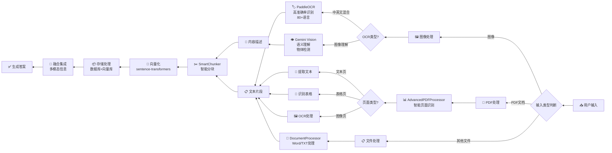

###### 多模态工具矩阵

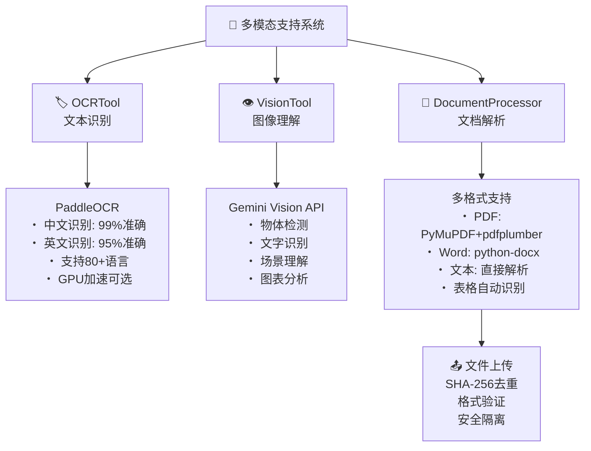

##### 领域特定智能 (Domain-Specific Intelligence)

系统实现了三个主要领域的专业化工具支持。WeatherTool通过OpenWeatherMap API提供实时天气预报、历史天气数据和极端天气预警等服务，支持全球范围的城市级和坐标级查询。FinanceTool采用双源策略实现高可靠性，Alpha Vantage为主力数据提供商，支持股票价格、技术指标和公司财务数据查询，yfinance作为备用方案保证服务连续性，用户还可查询加密货币价格。RoutingTool通过OpenRouteService API提供路线规划、距离计算和物流优化功能，支持多种交通方式包括汽车、骑行和步行。系统的路由器根据查询关键词自动识别对应的领域工具，例如识别到天气相关关键词时自动调用WeatherTool，财务数据查询时调用FinanceTool。这些工具通过标准化接口集成至核心系统，支持异步并发调用，用户可在单一查询中组合多个领域工具的结果，充分满足复杂的跨领域信息需求。

###### 领域工具架构与集成

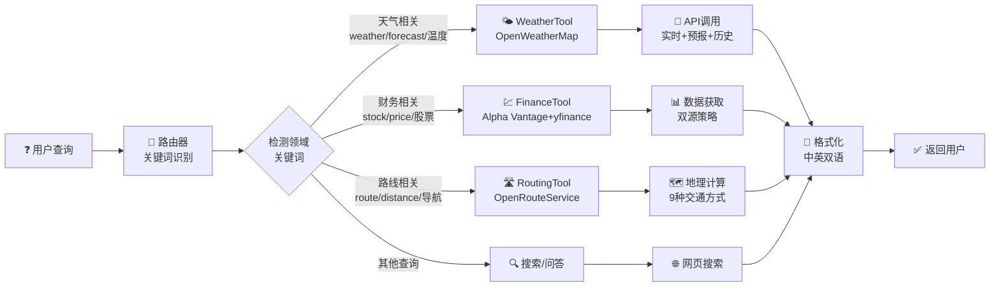

###### 领域工具详细能力对比

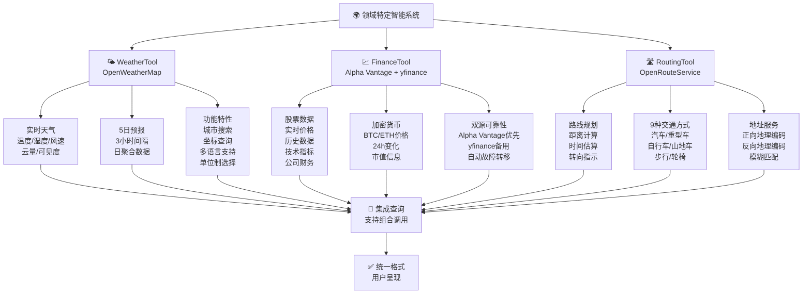

